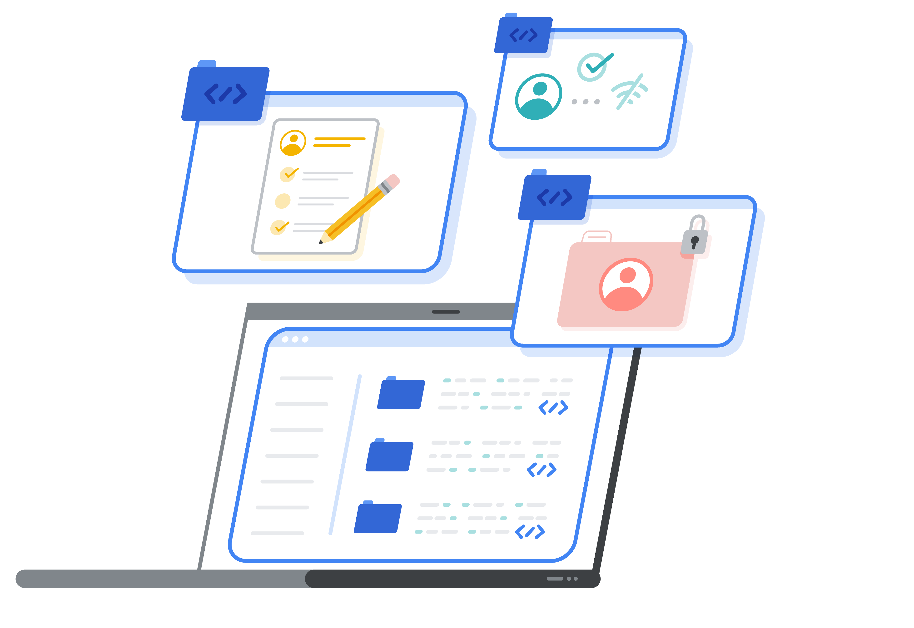

## What it is

The Android FHIR SDK is a set of Kotlin libraries for building offline-capable, mobile-first healthcare applications on Android using the HL7 FHIR standard.

The SDK was developed in close collaboration with the World Health Organization to support [WHO SMART Guidelines](https://www.who.int/teams/digital-health-and-innovation/smart-guidelines), which are based on the [FHIR Clinical Guidelines Implementation Guide](http://build.fhir.org/ig/HL7/cqf-recommendations/index.html).

Using the SDK, developers can build and deploy FHIR-native Android health applications for clinical care delivery, community health programs, and point-of-care decision support.

## Core advantages

- **Standards-based FHIR R4 data model** to build native Android health solutions using HAPI FHIR Structures, promoting interoperability and future-proofing application data.
- **Offline-first operation and sync** via encrypted local database storage paired with sync APIs to manage intermittent internet connectivity seamlessly.
- **Dynamic form rendering with SDC** turning FHIR Questionnaires into accessible UI forms at runtime with built-in validation, skip logic, and FHIRPath expressions.
- **On-device clinical reasoning** evaluating Clinical Quality Language (CQL) and FHIRPath on-device for clinical decision support and quality measure computation.
- **WHO SMART Guidelines support** running standardized clinical guidelines and care plans directly on mobile devices without constant server connectivity.

## SDK components and libraries

The Android FHIR SDK is organized into four modular libraries with clean separation of concerns.

### 1. Structured Data Capture (SDC) Library

The Structured Data Capture library enables applications to render and process standard FHIR `Questionnaire` and `QuestionnaireResponse` resources.

- Generates form fields and input controls at runtime using Material Design widgets.
- Supports advanced form behaviors including field-level validation, pagination, localization, and skip logic.
- Interprets dynamic form logic and calculated values using FHIRPath expressions.
- Supports automated form population from existing patient resources and structured data extraction into new FHIR resources upon submission.

### 2. FHIR Engine Library

The FHIR Engine library manages on-device persistence, querying, and synchronization.

- Stores FHIR resources in an encrypted local database on the Android device.
- Provides fluent Kotlin Domain Specific Language (DSL) search APIs for complex querying and patient list generation.
- Handles bidirectional synchronization between Android devices and standard FHIR servers (including HAPI FHIR and cloud FHIR repositories).

### 3. Workflow Library

The Workflow library executes clinical logic and manages personalized care delivery.

- Point-of-care clinical decision support for generating personalized FHIR `CarePlan` resources.
- Evaluates Clinical Quality Language (CQL) logic locally to calculate clinical metrics and protocol compliance.
- Implements WHO SMART Guidelines and FHIR Clinical Guidelines directly on mobile clients.

### 4. Knowledge Manager Library

The Knowledge Manager library deploys and indexes FHIR definitional resources (such as `Questionnaire`, `ValueSet`, `Library`, and `PlanDefinition` resources) packaged within Implementation Guides, making them available to the SDC and Workflow engines with optimal runtime performance.

## Next steps

- Explore [Tutorials & Codelabs](/tutorials-and-codelabs/) for step-by-step mobile implementation guides.
- Learn about the multiplatform evolution in [Kotlin FHIR Engine](/fhir-foundations/kotlin-fhir-engine/) and [Kotlin FHIR Data Capture](/fhir-foundations/kotlin-fhir-data-capture/).
- Visit the [android-fhir repository on GitHub](https://github.com/ohs-foundation/android-fhir) for release notes and sample applications.
