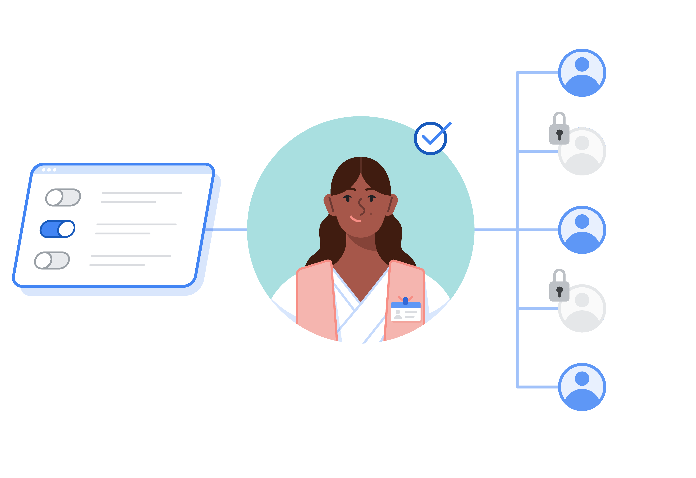

## What it is

Preserving patient data privacy and enforcing organizational access policies are critical requirements when deploying digital health systems.

Info Gateway is a standalone reverse proxy deployed between client applications and FHIR storage backends. It evaluates incoming HTTP requests against organizational role-based access control (RBAC) rules before routing them to the upstream FHIR server.



## Core capabilities

- **Authentication integration** works alongside any OpenID Connect compliant Identity Provider (such as Keycloak) and OAuth2 authorization server.
- **Granular access control** inspects FHIR REST URLs and query parameters to verify that the authenticated user possesses the permissions required for that specific clinical resource or search scope.
- **Pluggable access checkers** allow engineering teams to write custom authorization interceptors and business validation logic.
- **Query filtering and safety policies** enable administrators to restrict expensive search queries, disable unauthorized joins, or block full-table scans.
- **Mobile sync partitioning** limits the scope of patient records downloaded to frontline mobile devices based on practitioner assignments or health facility boundaries.
- **SMART-on-FHIR support** enables third-party clinical apps to connect into the digital health architecture safely without direct database access.

## Architecture

Info Gateway sits directly in the request path between clients and the FHIR backend.

```
┌─────────────────────────────────┐
│  Frontline Client / SMART Apps  │
└─────────────────────────────────┘
                 │
                 ▼  (Authenticated HTTPS Request)
┌─────────────────────────────────────────────────┐
│                  INFO GATEWAY                   │
│  ┌───────────────────┐  ┌────────────────────┐  │
│  │ Token Validation  │  │ Access Checkers    │  │
│  │ (Keycloak / OIDC) │  │ & Query Filters    │  │
│  └───────────────────┘  └────────────────────┘  │
└─────────────────────────────────────────────────┘
                 │
                 ▼  (Authorized FHIR Request)
┌─────────────────────────────────┐
│  FHIR Server (HAPI / Cloud)     │
└─────────────────────────────────┘
```

When a request arrives, processing proceeds through three steps.

1. **Identity verification** where Info Gateway validates the client bearer token against the configured OpenID Connect identity provider.
2. **Policy evaluation** where the access checkers examine the HTTP method, FHIR resource type, query parameters, and patient compartment boundaries.
3. **Upstream routing** where authorized requests are proxied to the upstream FHIR endpoint and unauthorized requests receive an HTTP 401 or 403 response.

## Tested environments

Info Gateway is tested and compatible with standard FHIR R4 servers including HAPI FHIR JPA server, cloud healthcare FHIR endpoints, and standard compliant FHIR REST services.

## Next steps

- Learn how to configure custom rules in [Gateway Access Rules codelab](/tutorials-and-codelabs/gateway-access-rules/).
- See how Info Gateway operates in the full stack in [The architecture](/ohs-player/architecture/).
- Check the [fhir-gateway repository on GitHub](https://github.com/ohs-foundation/fhir-gateway) for configuration guides and release details.
