## The end-to-end architecture

The diagram illustrates three primary layers within the reference environment.

- **Client layer** includes the multiplatform Frontline Client Application and the browser Web Admin Portal.
- **Backend services** include Info Gateway with custom extension plugins, Keycloak for identity, and an un-forked HAPI FHIR server.
- **Analytics layer** includes FHIR Data Pipes and PostgreSQL powering live Apache Superset dashboards.

## Foundational building blocks

Open Health Stack provides unbundled open source building blocks that can be imported independently into any digital health project.

| Foundational component | Capability provided | Consumed by |
| --- | --- | --- |
| `kotlin-fhir` | Type-safe FHIR data models and JSON serialization | Client App |
| `kotlin-fhirpath` | FHIRPath expression evaluation engine | Client App |
| `kotlin-fhir-engine` | On-device SQLite persistence and sync | Client App |
| `kotlin-fhir-data-capture` | Structured Data Capture (SDC) questionnaire rendering | Client App |
| Info Gateway | Authentication proxy and custom extension framework | Reference Backend |
| FHIR Data Pipes | SQL-on-FHIR extraction pipelines for analytics | Reference Analytics |

## What the Player reference toolkit adds

| Reference component | What it adds |
| --- | --- |
| Player Client | Renders dynamic screens from declarative FHIR configuration |
| Configuration IG | Standard FHIR implementation guide defining screen layouts and views |
| Reference Backend | Custom gateway endpoints and role-based access rules |
| Reference Analytics | SQL-on-FHIR view definitions, queries, and Superset dashboard definitions |
| Reference Infrastructure | Turnkey Docker Compose topology linking all services |

## Gateway routing and security

Neither client application connects directly to the underlying FHIR server. All network requests route through the Info Gateway reverse proxy.

- **Un-forked FHIR store** allows swapping HAPI FHIR for any standard FHIR server without altering client applications.
- **Centralized access control** validates OpenID Connect tokens from Keycloak and enforces role-based permissions at the gateway.
- **Decoupled administration** enables custom web portals to manage users, locations, and care teams purely through gateway APIs.

## How data flows

1. **Frontline data entry** occurs on mobile devices using Kotlin FHIR Engine for on-device SQLite storage and offline operation.
2. **Synchronization** transmits FHIR resource bundles through the gateway to the central FHIR server upon network connectivity.
3. **Administrative management** in the Web Admin Portal stores organisation, facility, and practitioner records directly as FHIR resources.
4. **Analytical transformation** reads transactional FHIR resources and applies SQL-on-FHIR view definitions via FHIR Data Pipes, writing flattened relational tables into PostgreSQL.
5. **Reporting** executes standard SQL queries against the analytical schema to populate dashboard metrics.

## Where to go next

- [The configuration model](/ohs-player/configuration-model/) explains how screens and forms are configured with standard FHIR resources.
- [Component directory](/components/) provides technical summaries for each reference piece.
