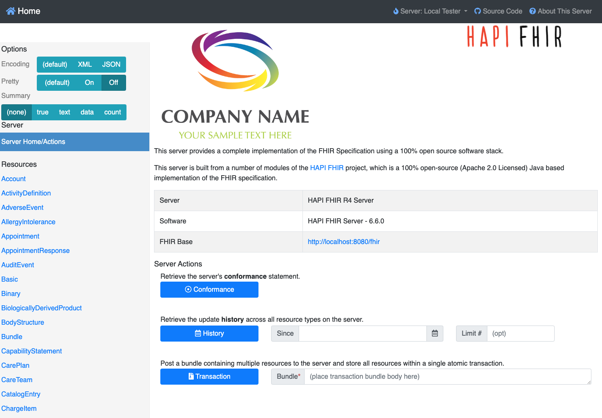
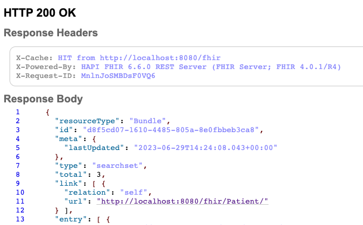
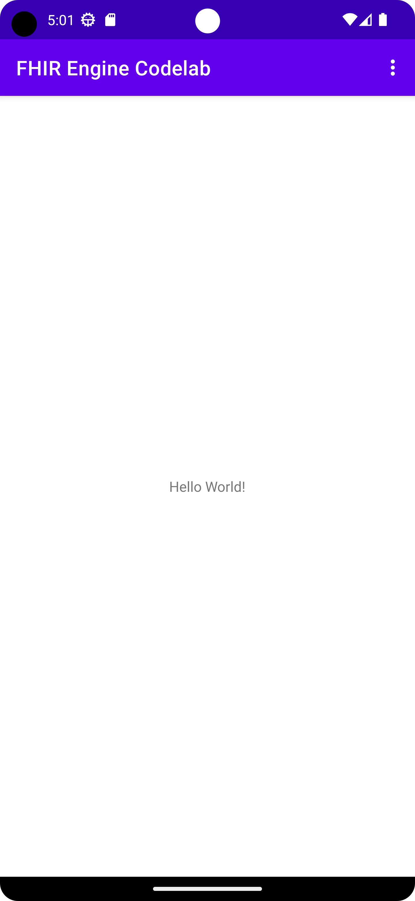

# Manage FHIR resources using FHIR Engine Library  |  Open Health Stack  |  Google for Developers

body {
transition: opacity ease-in 0.2s;
}
body[unresolved] {
opacity: 0;
display: block;
overflow: hidden;
position: relative;
}

# Manage FHIR resources using FHIR Engine Library

## 1. Before you begin

## What you'll build

In this codelab, you'll build an Android app using FHIR Engine Library. Your app will use FHIR Engine Library to download FHIR resources from a FHIR server, and upload any local changes to the server.

## What you'll learn

- How to create a local HAPI FHIR server using Docker
- How to integrate FHIR Engine Library into your Android application
- How to use the Sync API to set up a one-time or periodic job to download and upload FHIR resources
- How to use the Search API
- How to use the Data Access APIs to create, read, update, and delete FHIR resources locally

## What you'll need

- Docker ([get Docker](https://docs.docker.com/get-docker/))
- A recent version of [Android Studio (v4.1.2+)](https://developer.android.com/studio)
- [Android Emulator](https://developer.android.com/studio/run/emulator) or a physical Android device running Android 7.0 Nougat or later
- The sample code
- Basic knowledge of Android development in Kotlin

If you haven't built Android apps before, you can start by [building your first app](https://developer.android.com/training/basics/firstapp).

## 2. Set up a local HAPI FHIR server with test data

[HAPI FHIR](https://hapifhir.io/hapi-fhir/) is a popular open source FHIR server. We use a local HAPI FHIR server in our codelab for the Android app to connect to.

## Set up the local HAPI FHIR server

1. Run the following command in a terminal to get the latest image of HAPI FHIR

   ```
   docker pull hapiproject/hapi:latest
   ```
2. Create a HAPI FHIR container by either using Docker Desktop to run the previously download image `hapiproject/hapi`, or running the following command

   ```
   docker run -p 8080:8080 hapiproject/hapi:latest
   ```

   Learn [more](https://github.com/hapifhir/hapi-fhir-jpaserver-starter#running-via-docker-hub).
3. Inspect the server by opening the URL `http://localhost:8080/` in a browser. You should see the HAPI FHIR web interface.

## Populate the local HAPI FHIR server with test data

To test our application, we'll need some test data on the server. We'll use synthetic data generated by Synthea.

1. First, we need to download sample data from [synthea-samples](https://github.com/synthetichealth/synthea-sample-data/tree/master/downloads). Download and extract `synthea_sample_data_fhir_r4_sep2019.zip`. The un-zipped sample data has numerous `.json` files, each being a transaction bundle for an individual patient.
2. We'll upload test data for three patients to the local HAPI FHIR server. Run the following command in the directory containing JSON files

   ```
   curl -X POST -H "Content-Type: application/json" -d @./Aaron697_Brekke496_2fa15bc7-8866-461a-9000-f739e425860a.json http://localhost:8080/fhir/
   curl -X POST -H "Content-Type: application/json" -d @./Aaron697_Stiedemann542_41166989-975d-4d17-b9de-17f94cb3eec1.json http://localhost:8080/fhir/
   curl -X POST -H "Content-Type: application/json" -d @./Abby752_Kuvalis369_2b083021-e93f-4991-bf49-fd4f20060ef8.json http://localhost:8080/fhir/
   ```
3. To upload test data for all patients to the server, run

   ```
   for f in *.json; do curl -X POST -H "Content-Type: application/json" -d @$f http://localhost:8080/fhir/ ; done
   ```

   However, this can take a long time to complete and is not necessary for the codelab.
4. Verify that the test data is available on the server by opening the URL `http://localhost:8080/fhir/Patient/` in a browser. You should see the text `HTTP 200 OK` and the `Response Body` section of the page containing patient data in a FHIR Bundle as the search result with a `total` count.

## 3. Set up the Android app

## Download the Code

To download the code for this codelab, clone the Android FHIR SDK repository: `git clone https://github.com/ohs-foundation/android-fhir.git`

The starter project for this codelab is located in `codelabs/engine`.

## Import the app into Android Studio

We start by importing the starter app into Android Studio.

Open Android Studio, select **Import Project (Gradle, Eclipse ADT, etc.)** and choose the `codelabs/engine/` folder from the source code that you have downloaded earlier.


## Sync your project with Gradle files

For your convenience, the FHIR Engine Library dependencies have already been added to the project. This allows you to integrate the FHIR Engine Library in your app. Observe the following lines to the end of the `app/build.gradle.kts` file of your project:

```
dependencies {
    // ...

    implementation("com.google.android.fhir:engine:1.1.0")
}
```

To be sure that all dependencies are available to your app, you should sync your project with gradle files at this point.

Select **Sync Project with Gradle Files** ()from the Android Studio toolbar. You an also run the app again to check the dependencies are working correctly.

## Run the starter app

Now that you have imported the project into Android Studio, you are ready to run the app for the first time.

[Start the Android Studio emulator](https://developer.android.com/studio/run/emulator), and click Run () in the Android Studio toolbar.



## 4. Create FHIR Engine instance

To incorporate the FHIR Engine into your Android app, you'll need to use the FHIR Engine Library and initiate an instance of the FHIR Engine. The steps outlined below will guide you through the process.

1. Navigate to your Application class, which in this example is `FhirApplication.kt`, located in `app/src/main/java/com/google/android/fhir/codelabs/engine`.
2. Inside the `onCreate()` method, add the following code to initialize FHIR Engine:

   ```
     FhirEngineProvider.init(
         FhirEngineConfiguration(
           enableEncryptionIfSupported = true,
           RECREATE_AT_OPEN,
           ServerConfiguration(
             baseUrl = "http://10.0.2.2:8080/fhir/",
             httpLogger =
               HttpLogger(
                 HttpLogger.Configuration(
                   if (BuildConfig.DEBUG) HttpLogger.Level.BODY else HttpLogger.Level.BASIC,
                 ),
               ) {
                 Log.d("App-HttpLog", it)
               },
           ),
         ),
     )
   ```

   Notes:
   - `enableEncryptionIfSupported`: Enables data encryption if the device supports it.
   - `RECREATE_AT_OPEN`: Determines the database error strategy. In this case, it recreates the database if an error occurs upon opening.
   - `baseUrl` in `ServerConfiguration`: This is the FHIR server's base URL. The provided IP address `10.0.2.2` is specially reserved for localhost, accessible from the Android emulator. Learn [more](https://developer.android.com/studio/run/emulator-networking).
3. In the `FhirApplication` class, add the following line to lazily instantiate the FHIR Engine:

   ```
     private val fhirEngine: FhirEngine by
         lazy { FhirEngineProvider.getInstance(this) }
   ```

   This ensures the FhirEngine instance is only created when it's accessed for the first time, not immediately when the app starts.
4. Add the following convenience method in the `FhirApplication` class for easier access throughout your application:

   ```
   companion object {
       fun fhirEngine(context: Context) =
           (context.applicationContext as FhirApplication).fhirEngine
   }
   ```

   This static method lets you retrieve the FHIR Engine instance from anywhere in the app using the context.

## 5. Sync data with FHIR server

1. Create a new class `DownloadWorkManagerImpl.kt`. In this class, you'll define how the application fetches the next resource from the list to download.:

   ```
     class DownloadWorkManagerImpl : DownloadWorkManager {
       private val urls = LinkedList(listOf("Patient"))

       override suspend fun getNextRequest(): DownloadRequest? {
         val url = urls.poll() ?: return null
         return DownloadRequest.of(url)
       }

       override suspend fun getSummaryRequestUrls() = mapOf<ResourceType, String>()

       override suspend fun processResponse(response: Resource): Collection<Resource> {
         var bundleCollection: Collection<Resource> = mutableListOf()
         if (response is Bundle && response.type == Bundle.BundleType.SEARCHSET) {
           bundleCollection = response.entry.map { it.resource }
         }
         return bundleCollection
       }
     }
   ```

   This class has a queue of resource types it wants to download. It processes responses and extracts the resources from the returned bundle, which get saved into the local database.
2. Create a new class `AppFhirSyncWorker.kt` This class defines how the app will sync with the remote FHIR server using a background worker.

   ```
   class AppFhirSyncWorker(appContext: Context, workerParams: WorkerParameters) :
     FhirSyncWorker(appContext, workerParams) {

     override fun getDownloadWorkManager() = DownloadWorkManagerImpl()

     override fun getConflictResolver() = AcceptLocalConflictResolver

     override fun getFhirEngine() = FhirApplication.fhirEngine(applicationContext)

     override fun getUploadStrategy() =
       UploadStrategy.forBundleRequest(
         methodForCreate = HttpCreateMethod.PUT,
         methodForUpdate = HttpUpdateMethod.PATCH,
         squash = true,
         bundleSize = 500,
       )
   }
   ```

   Here, we've defined which download manager, conflict resolver, and FHIR engine instance to use for syncing.
3. In your ViewModel, `PatientListViewModel.kt`, you'll set up a one-time sync mechanism. Locate and add this code to the `triggerOneTimeSync()` function:

   ```
   viewModelScope.launch {
         Sync.oneTimeSync<AppFhirSyncWorker>(getApplication())
           .shareIn(this, SharingStarted.Eagerly, 10)
           .collect { _pollState.emit(it) }
       }
   ```

   This coroutine initiates a one-time sync with the FHIR server using the AppFhirSyncWorker we defined earlier. It will then update the UI based on the state of the sync process.
4. In the `PatientListFragment.kt` file, update the body of the `handleSyncJobStatus` function:

   ```
   when (syncJobStatus) {
       is SyncJobStatus.Finished -> {
           Toast.makeText(requireContext(), "Sync Finished", Toast.LENGTH_SHORT).show()
           viewModel.searchPatientsByName("")
       }
       else -> {}
   }
   ```

   Here, when the sync process finishes, a toast message will display notifying the user, and the app will then display all patients by invoking a search with an empty name.

Now that everything is set up, run your app. Click the `Sync` button in the menu. If everything works correctly, you should see the patients from your local FHIR server being downloaded and displayed in the application.


## 6. Modify and Upload Patient Data

In this section, we will guide you through the process of modifying patient data based on specific criteria and uploading the updated data to your FHIR server. Specifically, we will swap the address cities for patients residing in `Wakefield` and `Taunton`.

## **Step 1**: Set Up the Modification Logic in PatientListViewModel

The code in this section is added to the `triggerUpdate` function in `PatientListViewModel`

1. **Access the FHIR Engine**:Start by getting a reference to the FHIR engine in the `PatientListViewModel.kt`.

   ```
   viewModelScope.launch {
      val fhirEngine = FhirApplication.fhirEngine(getApplication())
   ```

   This code launches a coroutine within the ViewModel's scope and initializes the FHIR engine.
2. **Search for Patients from Wakefield**:Use the FHIR engine to search for patients with an address city of `Wakefield`.

   ```
   val patientsFromWakefield =
        fhirEngine.search<Patient> {
          filter(
            Patient.ADDRESS_CITY,
            {
              modifier =  StringFilterModifier.MATCHES_EXACTLY
              value = "Wakefield"
            }
          )
        }
   ```

   Here, we are using the FHIR engine's `search` method to filter patients based on their address city. The result will be a list of patients from Wakefield.
3. **Search for Patients from Taunton**:Similarly, search for patients with an address city of `Taunton`.

   ```
   val patientsFromTaunton =
        fhirEngine.search<Patient> {
          filter(
            Patient.ADDRESS_CITY,
            {
              modifier =  StringFilterModifier.MATCHES_EXACTLY
              value = "Taunton"
            }
          )
        }
   ```

   We now have two lists of patients - one from Wakefield and the other from Taunton.
4. **Modify Patient Addresses**:Go through each patient in the `patientsFromWakefield` list, change their city to `Taunton`, and update them in the FHIR engine.

   ```
   patientsFromWakefield.forEach {
        it.resource.address.first().city = "Taunton"
        fhirEngine.update(it.resource)
   }
   ```

   Similarly, update each patient in the `patientsFromTaunton` list to have their city changed to `Wakefield`.

   ```
   patientsFromTaunton.forEach {
        it.resource.address.first().city = "Wakefield"
        fhirEngine.update(it.resource)
   }
   ```
5. **Initiate Synchronization**:After modifying the data locally, trigger a one-time sync to ensure the data is updated on the FHIR server.

   ```
   triggerOneTimeSync()
   }
   ```

   The closing brace `}` signifies the end of the coroutine launched at the beginning.

## **Step 2**: Test the Functionality

1. **UI Testing**:Run your app. Click the `Update` button in the menu. You should see the address cities for patient `Aaron697` and `Abby752` swapped.
2. **Server Verification**:Open a browser and navigate to `http://localhost:8080/fhir/Patient/`. Verify that the address city for patients `Aaron697` and `Abby752` is updated on the local FHIR server.

By following these steps, you've successfully implemented a mechanism to modify patient data and synchronize the changes with your FHIR server.

## 7. Search for Patients by Name

Searching for patients by their names can provide a user-friendly way of retrieving information. Here, we'll walk you through the process of implementing this feature in your application.

## **Step 1**: Update the Function Signature

Navigate to your `PatientListViewModel.kt` file and find the function named `searchPatientsByName`. We will be adding code into this function.

To filter the results based on the provided name query, and emit the results for the UI to update, incorporate the following conditional code block:

```
    viewModelScope.launch {
      val fhirEngine = FhirApplication.fhirEngine(getApplication())
      if (nameQuery.isNotEmpty()) {
        val searchResult = fhirEngine.search<Patient> {
          filter(
            Patient.NAME,
            {
              modifier = StringFilterModifier.CONTAINS
              value = nameQuery
            },
          )
        }
        liveSearchedPatients.value  =  searchResult.map { it.resource }
      }
    }
```

Here, if the `nameQuery` is not empty, the search function will filter the results to only include patients whose names contain the specified query.

## **Step 2**: Test the New Search Functionality

1. **Relaunch the App**:After making these changes, rebuild and run your app.
2. **Search for Patients**: On the patient list screen, use the search functionality. You should now be able to enter a name (or part of a name) to filter the list of patients accordingly.

With these steps completed, you've enhanced your application by providing users with the ability to efficiently search for patients by their names. This can significantly improve user experience and efficiency in data retrieval.

## 8. Congratulations!

You have used the FHIR Engine Library to manage FHIR resources in your app:

- Use Sync API to sync FHIR resources with a FHIR server
- Use Data Access API to create, read, update, and delete local FHIR resources
- Use Search API to search local FHIR resources

## What we've covered

- How to set up a local HAPI FHIR server
- How to upload test data to the local HAPI FHIR Server
- How to build an Android app using the FHIR Engine Library
- How to use Sync API, Data Access API, and Search API in the FHIR Engine Library

## Next Steps

- Explore the documentation for the FHIR Engine Library
- Explore the advanced features of the Search API
- Apply the FHIR Engine Library in your own Android app

## Learn More

- [FHIR Engine developer documentation](https://github.com/ohs-foundation/android-fhir/wiki/FHIR-Engine-Library)

Except as otherwise noted, the content of this page is licensed under the [Creative Commons Attribution 4.0 License](https://creativecommons.org/licenses/by/4.0/), and code samples are licensed under the [Apache 2.0 License](https://www.apache.org/licenses/LICENSE-2.0). For details, see the [Google Developers Site Policies](https://developers.google.com/site-policies). Java is a registered trademark of Oracle and/or its affiliates.

[[["Easy to understand","easyToUnderstand","thumb-up"],["Solved my problem","solvedMyProblem","thumb-up"],["Other","otherUp","thumb-up"]],[["Missing the information I need","missingTheInformationINeed","thumb-down"],["Too complicated / too many steps","tooComplicatedTooManySteps","thumb-down"],["Out of date","outOfDate","thumb-down"],["Samples / code issue","samplesCodeIssue","thumb-down"],["Other","otherDown","thumb-down"]],[],[],[]]
