# Design Guidelines for Data Capture  |  Open Health Stack  |  Google for Developers

/\* Styles inlined from /open-health-stack/styles/ohs.css \*/
.ohs-padding-large-top {
padding-top: 96px !important;
}
.ohs-padding-large-bottom {
padding-bottom: 96px !important;
}
.ohs-padding-large {
padding-top: 96px !important;
padding-bottom: 96px !important;
}
.ohs-design-padding-top {
padding-top: 64px !important;
}
.ohs-design-padding-bottom {
padding-bottom: 40px !important;
}
.ohs-padding-xsmall-bottom {
padding-bottom: 32px !important;
}
.ohs-caption {
font-size: 0.875em;
}

# Design Guidelines for Data Capture

## Page Summary

- This guide provides best practices for designing mobile health app questionnaires using the Structured Data Capture (SDC) library, focusing on layout, navigation, question structure, and component selection.
- Choose between Long Scroll (faster, better for short questionnaires) or Paginated layouts (more precise, better for complex questionnaires and accessibility) based on your needs and optimize them for readability and navigation.
- Structure questions with clear titles, instructions, and appropriate input components (e.g., Boolean Choice for yes/no, Dropdown for long lists, Text Field for unique data, minimizing free-text) to enhance data quality and user experience.
- Implement robust data validation with clear, immediate error messages that guide users toward correct input, ensuring data integrity and a smoother user experience.
- Prioritize structured data capture by minimizing free-text input and utilizing components like dropdowns, multiple-choice, and date pickers whenever possible for better data quality and user experience.

## Introduction

Completing questionnaires is a core task for most healthcare workers using
mobile health apps.

Data entry can be difficult and errors happen. Our goal with the [Structured
Data Capture (SDC) library](/open-health-stack/android-fhir/data-capture) and the
design guidelines is to empower you to improve the user experience of data entry
and the quality of captured data.

The four themes covered in this section are:

1. [Layout & navigation](#layout_navigation)
2. [Questions and instructions](#questions_instructions)
3. [Data capture](#data_capture)
4. [Data validation and error messages](#data_validation_and_errors)

## Layout & navigation

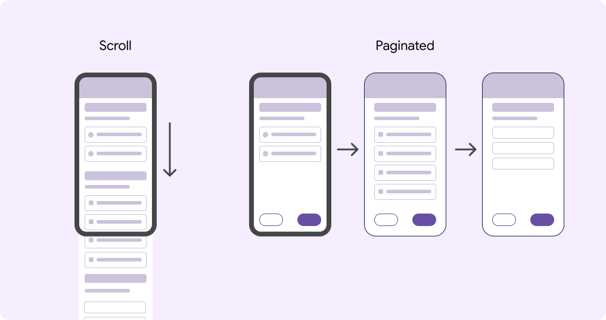

### Long scroll & paginated layout

Long scroll layout (left) and paginated layout (right).

The Android FHIR SDK has two layout options for you to choose between:

1. Long scroll (default)
2. Paginated

A *long scroll* questionnaire shows all questions on one page and users navigate
to each question by scrolling.

A *paginated* questionnaire displays the content across separate pages. Related
questions or input fields can be grouped together on one page. Back and next
buttons are anchored at the bottom of the page to navigate between pages.

[Learn how to make a questionnaire paginated on
GitHub](https://github.com/ohs-foundation/android-fhir/wiki/SDCL%3A-Author-questionnaires#pagination)

### Which layout should you select?

Each layout option has its advantages and disadvantages. Below are some
attributes of each layout type to consider as you're making the choice about
which layout to use.

|  | Long scroll | Paginated |
| --- | --- | --- |
| **Speed of navigation** | check\_circle Faster to navigate | warning Slower to navigate |
| **Accuracy of navigation** | warning Less precise navigation | check\_circle More precise navigation |
| **Refocus on question after task switching** | warning Difficult to reorient after interruption | check\_circle Easier to reorient after interruption |
| **Completing the digital questionnaire after the visit (copying from paper)** | check\_circle Easier when copying from paper | warning More difficult when copying from paper |
| **Small screens** | warning Worse for small screens | check\_circle Better for small screens |
| **Accessibility** | warning Worse for accessibility. Difficult to navigate. | check\_circle Better for accessibility. Discrete screens that can be handled by screen readers, text-to-speech, and other technologies. |
| **Space for instructions and explanations** | warning Worse for guidance and instructions | check\_circle Better for guidance and instructions |

### Long scroll

Do — Number questions  
Number the questions to make it easier to navigate in a single page layout.

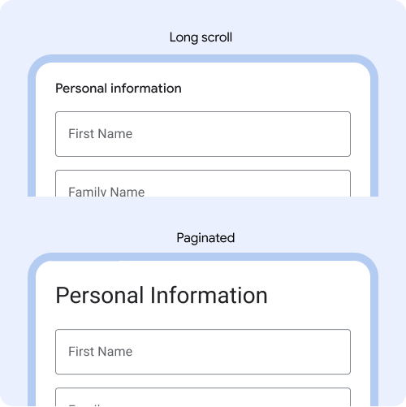

Do — Adjust font size  
Make the font size of question titles smaller when using long scroll, so
more content is visible on the screen. Example: Long scroll is 16px.
Paginated is 28px.

### Pagination

Do — One question per page  
Keyboards, dropdowns and other components take up space on the page, so
aim for one question per page.

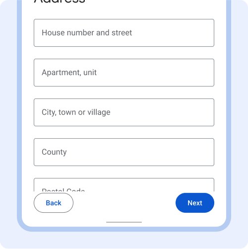

Don't — Hide content below the fold  
Content should be visible above the fold.

Do — Group related content as one question  
Example: These three text fields are all related to alternative contact
person info, so they are grouped together on one page.

Don't — Group unrelated content  
Avoid grouping unrelated content on one page, to avoid confusion.

### Progress indicator

The *progress indicator* reflects progress made within a questionnaire.

Include a *progress indicator* on long questionnaires to help users navigate and
see progress. *Progress indicators* show location within a questionnaire, and
how much is left to complete.

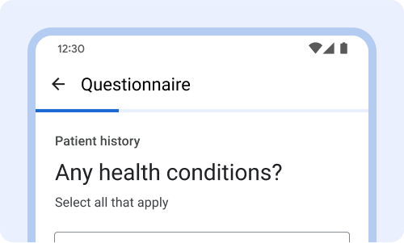

Do — Long scroll layout  
Position at top above the question and anchor so it is always visible even
when scrolling.

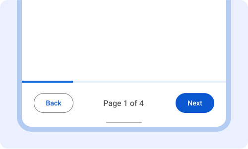

Do — Paginated layout only  
Can position at the bottom instead, above the back and next buttons. With
this layout you can also display which page the user is on.

### Navigation Buttons

*Navigation buttons* (back, next) are anchored at the bottom of the
questionnaire. In an infinite scroll or on the last page of a paginated
questionnaire the next button is labeled Submit.

Keep buttons in a consistent location and always use active buttons that are
labeled with their action, such as back and next.

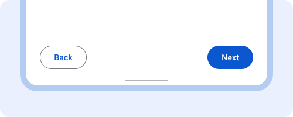

Do — Active buttons  
Always display active buttons, even if forms are incomplete. Upon tapping
next, show a pop-up dialog with instructions for completing missing fields
or validation errors.

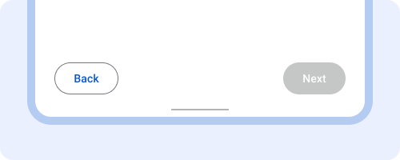

Don't — Inactive buttons  
Inactive buttons make it hard for users to know how to fix the problem.

Don't — Icon only buttons  
Avoid icon only buttons. Always label buttons with a descriptive action.

## Questions & instructions

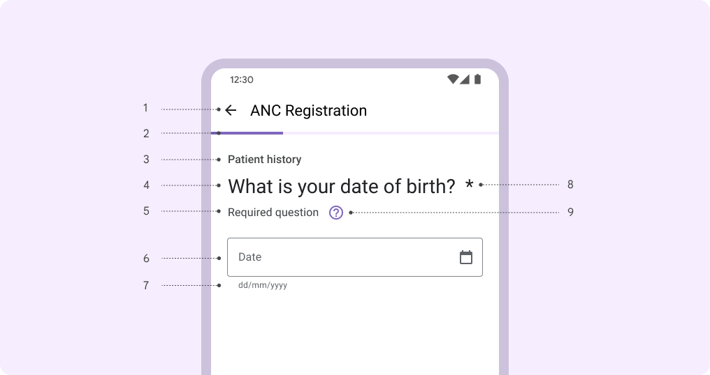

Overview of the 9 components covered in this section and how the components
are combined in a paginated questionnaire.

1. Questionnaire title.
2. Progress indicator.
3. Group header.
4. Question title.
5. Instructions.
6. Input field.
7. Entry format.
8. Required fields.
9. Help.

### Group header

*Group header* is a text header that is displayed above question titles.

Use the *group header* to group similar questions together. Only use the *group
header* when it adds helpful information.

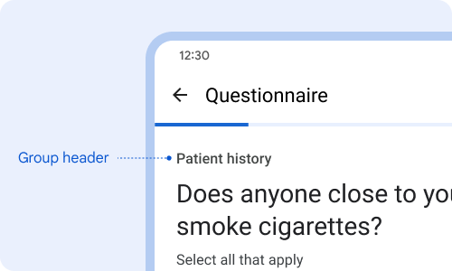

Do — Short titles  
Use a short title to group similar questions together. Example: all
questions related to patient history are grouped.

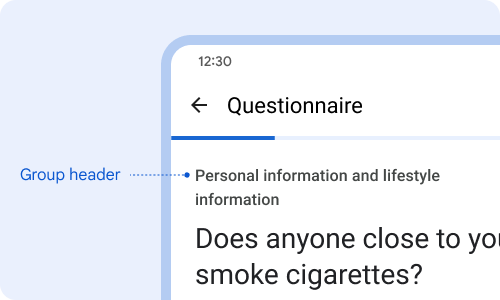

Don't — Long titles  
Avoid complex titles or long titles that go beyond one line.

### Question title

The *question title* succinctly describes what information is requested.
*Question titles* have the largest font size on the page to draw the user's eyes
to the question.

Every page or question should have a *question title*. Keep question titles
short or phrase it as a question.

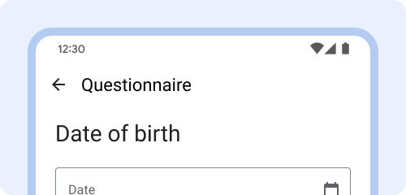

Do — Short question title  
Short titles make it easier for users to read.

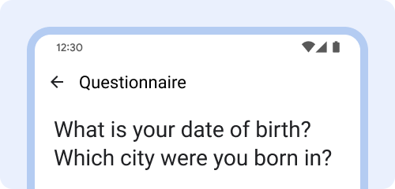

Don't — Long question title  
Avoid very long questions or nesting two questions together.

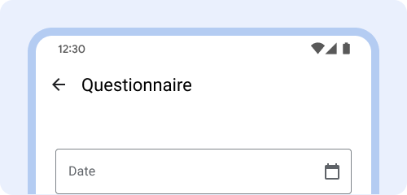

Don't — No question title  
Always include a question title to make it easier for users to know what
information they need to enter.

### Instructions

*Instructions* is an optional text field shown below the question title.

Use the *instructions* field to explain relevant instructions such as if the
question is required, how many selections can be made (one or many), and what
users should do if unable to complete all info or answer the question.

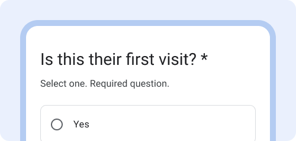

Do — Explain what is required  
Use instructions field to inform if a question is required and how many
selections can be made.

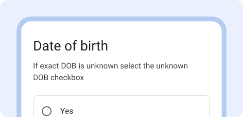

Do — Explain what to do for edge cases  
Use instructions to let users know what to do if they encounter a scenario
like they are unable to complete all the fields.

Do — Explain context or definitions  
Use instructions to provide additional context or definitions for terms used
in the question title.

### Label text

*Label text* informs users about what information is requested for a text field
or dropdown. When the field is selected, the *label text* moves from the middle
of the text field to the top.

Every *text field* and *dropdown* box should have a label. *Label text* should
be short, clear, and fully visible.

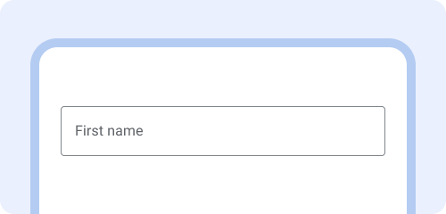

Do — Be concise  
Label text should be short, clear, and fully visible.

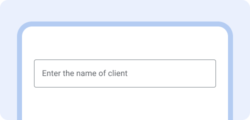

Don't — Be wordy  
Label text shouldn't be too long, truncated, or take up multiple lines.

Don't — No label  
Always label the text field so users know what information to enter.

### Entry format

*EntryFormat* is shown below the text field to inform users of the specific
format data needs to be entered in. Error messages will be displayed in the
EntryFormat field and replace existing EntryFormat instructions.

Use EntryFormat for dates, phone numbers, units, and integers.

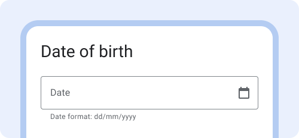

Do — Use EntryFormat  
Show date format below the field and include a descriptive phrase.

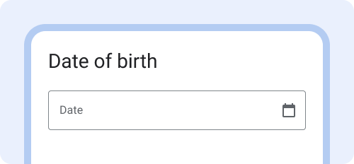

Don't — No EntryFormat  
Not showing data formats can lead to data being entered incorrectly.

Do — Show normal range  
When entering medical ranges, provide examples of the normal range. This can
help users catch errors or numbers that are out of range.

### Required fields

*Required fields* indicate that a user must complete the field and is blocked
from advancing until the field is completed.

To indicate that a field is required, display an asterisk (\*) at the end of the
question title. Include 'required question' in the instructions field as it is
not obvious to everyone what an asterisk (\*) indicates. If there's no question
title, display the asterisk (\*) in the label text.

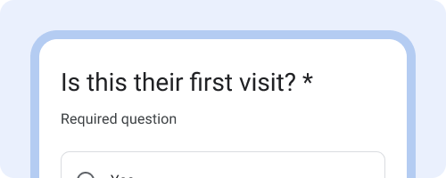

Do — Written explanation  
Show the field is required with asterisk (\*) and include written
instructions that indicate `required question.` Many are unfamiliar with
what the asterisk(\*) means and would benefit from the explanation.

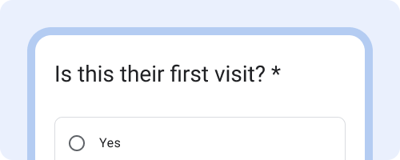

Don't — No explanation  
Avoid showing only the asterisk (\*) without any written description of what
it means.

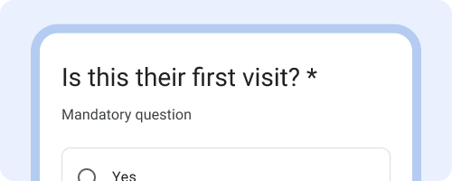

Do — Localize terminology  
Use the terms that are most familiar to your users. Example: "Mandatory"
might be the more familiar term and used in some countries instead of
"Required".

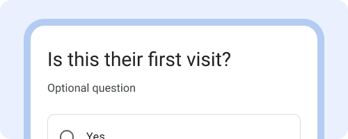

Do — Indicate optional questions instead  
If most questions are required, indicate which ones are optional instead.

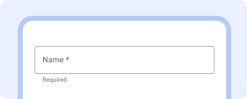

Do — Show asterisk in label text instead  
If there's no question title show the asterisk in the label text.

### Help

A *help* icon is displayed next to the question title. Upon tapping the icon, a
help information box appears with additional information. Tapping the icon again
closes the help information box.

This is an optional component. Only use when helpful to display additional
information that does not need to always be visible.

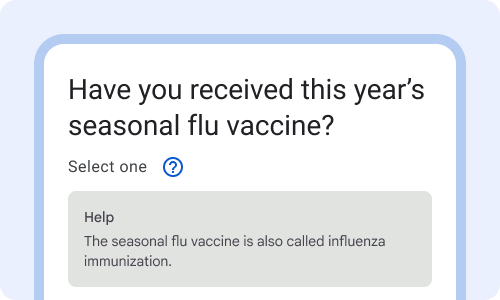

Do — Show optional info in help box  
Use help for information that users might only need to see once or that
provides additional information.

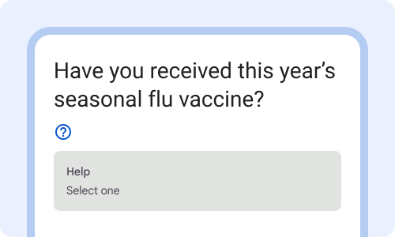

Don't — Hide instructions in help box  
Avoid hiding instructions inside the Help box that should be visible to
everyone.

## Data capture

Eight of the primary data capture components in the Android FHIR SDK.

### When to use which component?

| Type of data entry | Boolean choice | Single choice | Multiple choice | Open choice | Dropdown | Date picker | Text field | Slider | Auto-complete |
| --- | --- | --- | --- | --- | --- | --- | --- | --- | --- |
| Select Yes or No | check\_circle |  |  |  |  |  |  |  |  |
| Select one option |  | check\_circle |  |  | check\_circle |  |  |  | warning caution |
| Select multiple options |  |  | check\_circle |  |  |  |  |  | warning caution |
| Text |  |  |  | check\_circle |  |  | check\_circle |  |  |
| Dates |  |  |  |  |  | check\_circle | check\_circle |  |  |
| Numbers |  |  |  |  |  |  | check\_circle | warning caution |  |

### Text fields

*Text fields* indicate that users can enter information.

Use *text fields* when someone needs to enter text into the questionnaire, such
as a name, phone number, or address. Limit data entry that requires text
(keyboard) entry when a pre-populated selection (multiple choice or single
choice) can be used instead.

[Learn more about text fields on
material.io](https://m3.material.io/components/text-fields/overview)

Do — Use text fields for unique data entry  
Use text fields for data entry that requires typing unique words or numbers.

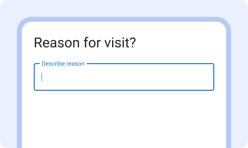

Don't — Limit use of free text responses  
Avoid using free text responses when it could be a multiple-selection,
dropdown, or single choice selection instead.

### Single choice & boolean choice

*Single choice* and *boolean choice* are a selection control that appear as
radio buttons when users are asked to select one choice from options.

Use *boolean choice* when there's a binary choice of 'Yes' or 'No.' Otherwise,
use the *single choice* component. If there's more than ~10 options in the list,
use a *dropdown* instead of *single choice*. A dropdown is more dense and easier
to navigate when there are many options.

Do — Boolean choice  
Use Boolean choice when the options are 'yes' and 'no'.

Do — Single choice  
Use single choice when users can select one option in the list.

Don't — Very long lists  
Avoid single choice for very long lists (10+). Use a dropdown instead.

### Date picker

The *date picker* allows users to enter dates through both the calendar date
picker and the keyboard. The calendar date picker is activated when the calendar
icon is tapped.

Use the calendar date picker only for dates that are close to today's date such
as last menstrual period or next visit. Otherwise prioritize keyboard entry for
dates like birthdate.

Do — Both entry options  
For entering dates enable both keyboard entry (tapping text box) and
calendar date picker (tapping icon).

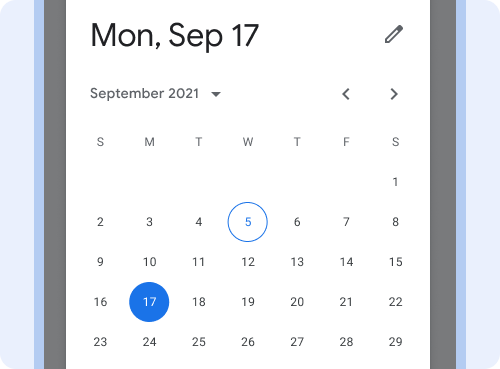

Don't — Avoid calendar only  
Avoid enabling the calendar date picker as the only input method for birth
dates. Navigating to the month and year is difficult.

### Dropdown

*Dropdown* menus allow users to make a selection from multiple options. As the
user begins typing, options filter based on what's entered. This can help users
quickly find the right option from a large list.

*Dropdown* menus are a great alternative to *single choice* when the list of
options is very long (10+ options) as they take up less space.

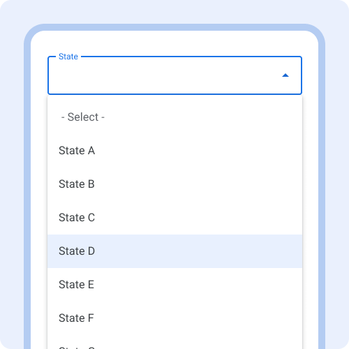

Do — Use for long lists  
Use a dropdown when selecting one option in a very long list of options,
such as selecting a state or city.

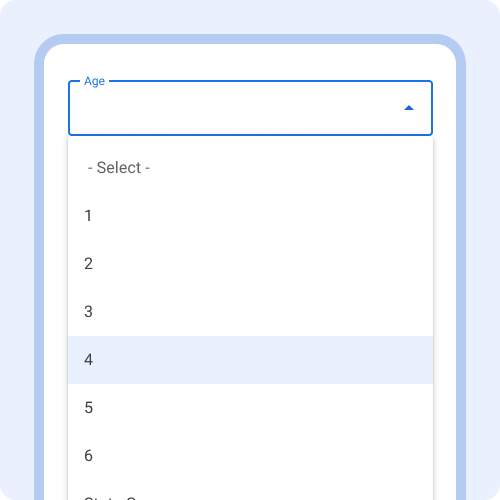

Don't — When typing is easy  
Avoid using a dropdown when it would be easier to type the content in rather
than scrolling through all the options, such as age.

### Multiple choice

*Multiple choice* is a selection control that appears as checkboxes when users
can make multiple sections from a list of options.

Use *multiple choice* when users can only select from a predetermined list of
options. If users can also add their own free response, use the *open choice*
component instead. In the *instructions* field write "Select all that apply" so
users know they can select multiple options.

Do — One selection per row  
The default appearance is a container around checkboxes to make the tappable
area obvious.

Don't — Multiple options per row  
Avoid displaying multiple options per row, due to the variation in phone
screen size and text size, the text can get cut off.

### Open choice

*Open choice* is similar to multiple choice, but adds the ability for a user to
select
**Other** and type in free text.

Use *open choice* when there's a pre-set list of options, but users can also add
additional options. Use *open choice* when the majority of options are known,
but you foresee some users will select **Other** because none of the supplied
options apply.

Do — Use for more accurate data collection  
Use when it's important that accurate data is collected and none of the
predefined options apply. Example: occupation.

Don't — If all responses will be other  
Avoid using if the majority of responses would require selecting
**Other**. In that case, use a text field or paragraph field instead.

### Slider

*Sliders* allow users to make selections from a range of values. The slider in
the Android FHIR SDK is a discrete slider. A discrete slider allows users to
select a specific value from a predetermined range. Tick marks may be used to
indicate available values. Avoid using the slider for numerical data entry.
Instead use a text field or a dropdown menu.

[Learn more about sliders on
material.io](https://m3.material.io/components/sliders/guidelines)

Don't — Use slider for specific numbers  
Avoid using the slider for specific values when there's a large range. Use
text fields with keyboard entry instead.

## Data validation and errors

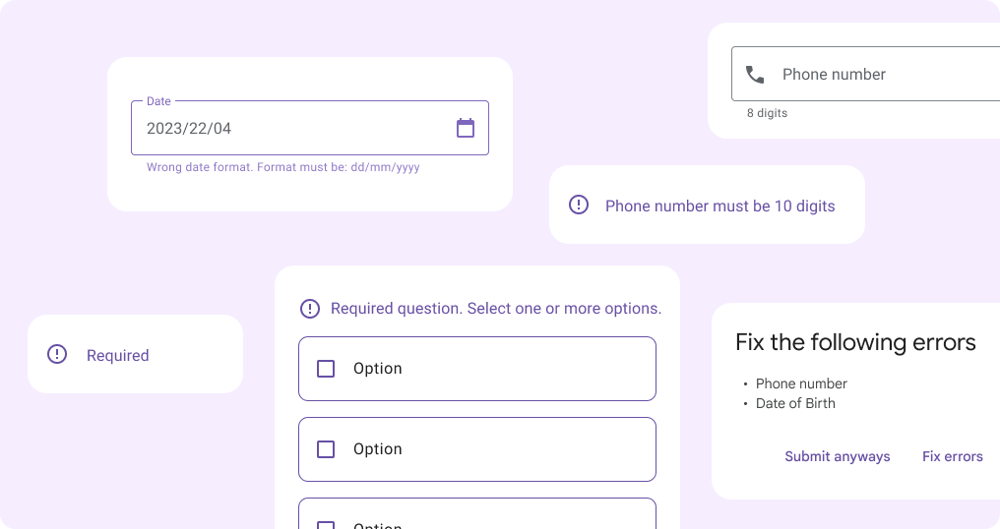

### Data validation

Data validations constrain the type of data or the values that can be entered in
a text field. Data validation can improve the quality of data collected.

Use the *EntryFormat* field to display format or value restrictions. Show
meaningful data validation error messages in-line and immediately so users can
fix the error.

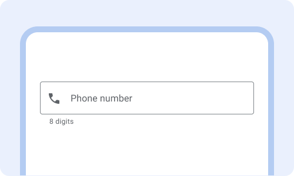

Do — Show validation restrictions  
Show data validation restrictions upfront so users know how to enter the
data.

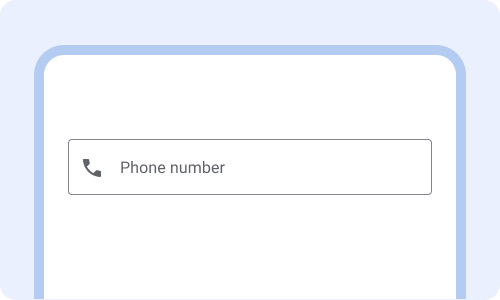

Don't — Hide validation restrictions  
Without showing how many digits the phone number needs to be, users are
likely to encounter an error and it will take longer to complete.

Do — Show validation errors immediately  
Show meaningful data validation errors immediately after completing the
field. Error messages replace the existing entry format text.

Don't — Wait until after submitting  
Don't wait until the user has pressed "submit" to display validation errors
for the first time.

### Errors

Error messages alert users when something goes wrong and communicate how to fix
the problem.

Use color, iconography and text to communicate errors.

[Learn more about error messages on
material.io](https://m3.material.io/components/text-fields/guidelines#9ad90554-a793-4506-9075-6812fd7b381a)

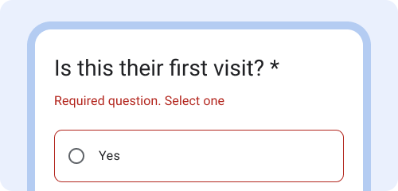

Do — Clearly describe how to fix error  
Explain why there’s an error (required question) and what can be done to fix
it (select one.)

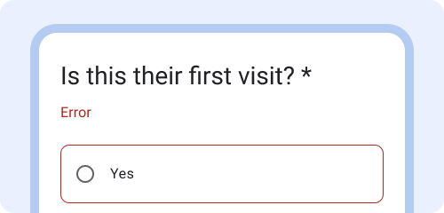

Don't — Write only "error"  
An error message that only says "error" is not helpful for users to know
how to fix the error.

Do — Explain how to fix the error without blame  
Example: "Wrong date format. Format must be dd/mm/yyyy".

Don't — Blame the user  
Avoid blaming the user with error messages that include "you" Example: "You
entered the wrong date format."

Do — Multiple cues  
Use color, iconography and text to inform users that there is an error.

Don't — Rely only on color  
To support common visual impairments such as red-green color blindness,
avoid relying only on color to communicate an error.

Don't — Overuse icons  
One icon is often enough. Don't overdo it on the use of icons to communicate
the error.
