# Design Guidelines for Offline & Sync  |  Open Health Stack  |  Google for Developers

/\* Styles inlined from /open-health-stack/styles/ohs.css \*/
.ohs-padding-large-top {
padding-top: 96px !important;
}
.ohs-padding-large-bottom {
padding-bottom: 96px !important;
}
.ohs-padding-large {
padding-top: 96px !important;
padding-bottom: 96px !important;
}
.ohs-design-padding-top {
padding-top: 64px !important;
}
.ohs-design-padding-bottom {
padding-bottom: 40px !important;
}
.ohs-padding-xsmall-bottom {
padding-bottom: 32px !important;
}
.ohs-caption {
font-size: 0.875em;
}

# Design Guidelines for Offline & Sync

## Page Summary

- Healthcare apps should prioritize offline functionality, allowing primary workflows to be completed without internet access.
- Clear communication about sync status, frequency, and duration is crucial for a positive user experience.
- Timestamps on key data like tasks and patient records provide context and ensure continuity of care.
- Manual sync options and actionable error messages empower users to manage data and troubleshoot issues effectively.
- Sync intervals should be optimized for healthcare settings, minimizing distractions and prioritizing relevant data.

## Introduction

Apps that work offline give healthcare workers access to the tools they need to provide quality care, even when they are not connected to the internet. Offline apps are useful for healthcare workers who work in community environments where there is unreliable connectivity or at a healthcare facility without internet access. Offline apps can also help reduce data costs.

If healthcare workers can't use an app offline, they may not be able to complete important tasks. This can result in healthcare workers not using the app and loss of data. With the FHIR Engine library and these design guidelines we aim to improve the user experience of offline capable health apps so they're reliable and easy to use.

## Key offline principles

Consider these principles when building offline health apps:

1. Community healthcare worker apps should be designed for an offline-first experience.
2. Ensure users can complete their primary workflow offline.
3. Inform users of how frequently they need to go online to sync their device.

## Initial sync

Your app may require an initial sync to download tasks or a patient list, before a healthcare worker can begin using the app. If so, make initial sync a distinct step as part of healthcare workers getting started using the app. Provide guidance on where and when to do it, and an estimate for how much time it will take. Explain if the app needs to be open or whether healthcare workers can do other things on their device while it syncs.

Do — Clear expectations  
Provide clear expectations of how long it will take.

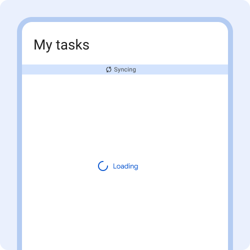

Don't — No information  
Don't start initial sync without providing any information about what to expect.

## Status bar

The status bar indicates if the device is offline or syncing. The status bar appears when:

1. The device is offline due to no internet connectivity
2. Data is actively syncing
3. Sync has failed
4. Sync is completed

Only show the status bar when relevant - on pages or around components that will change when data is done syncing. For example, the status is important when looking at a task list, searching a patient list or loading a patient card so the healthcare worker can recognize if the latest info has synced or not.

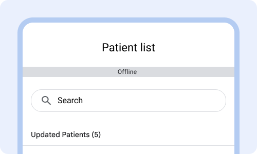

Do — Show offline status  
Show offline status when relevant, for instance when loading the patient list.

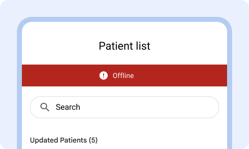

Don't — Look like an error  
Avoid making the connectivity status bar look like an error state.

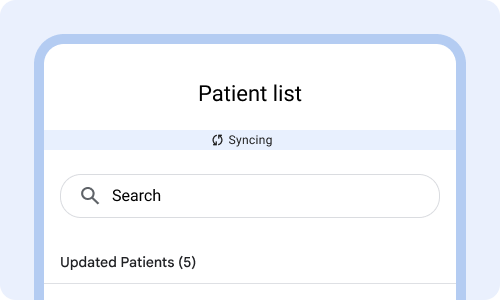

Do — Show sync status  
When connectivity is established show that the app is syncing in the status bar.

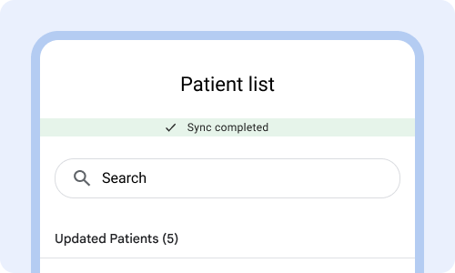

Do — Show sync confirmation  
Show confirmation of completing sync by changing the icon to a checkmark and changing the color and text in the status bar. This helps users know that information has been completed.

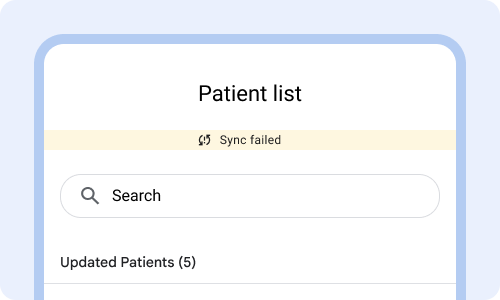

Do — Show if sync failed  
If sync didn't complete, then show that it failed to complete sync. If the cause of sync failing is that the app is offline, change the status to offline. Important for people to know what is happening.

## Sync patterns

Sync works in the background to upload and download data to and from the server. The sync behavior shouldn't be distracting to the user.

Sync intervals should be set based on thresholds that are relevant to the healthcare setting the app is used in. Example: sync every 12 hours in a community setting or every 15 minutes in a healthcare facility. Having the right automatic sync intervals minimize the need for manual sync.

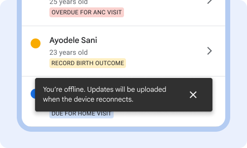

Do — Reassure  
Reassure users that even though the app is offline that they can still complete their tasks and that changes will be uploaded when connectivity resumes.

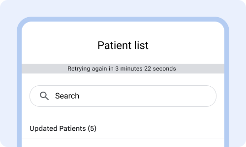

Don't — Distract with too much detail  
Avoid going into detail of when sync is going to retry connecting to the internet.

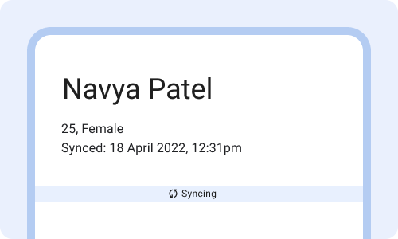

Do — Prioritize what to sync  
Prioritize what data is synced so that healthcare workers can complete their workflow. Example: in a facility where patients are handed off to another healthcare worker, make sure to prioritize syncing the patient card that was just completed.

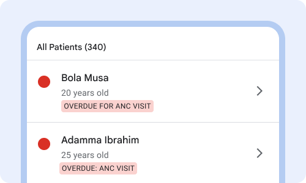

Don't — Sync irrelevant info first  
Avoid syncing irrelevant info first such as the entire patient list, or old visit history that's unrelated to today's tasks.

## Sync progress indicator

A sync progress indicator appears when the content is syncing from the server. The progress indicator should visually show that sync is working.

Only add a progress indicator on key screens, such as the patient list or patient card. Provide an estimate for how long sync will take by showing what percentage has been downloaded.

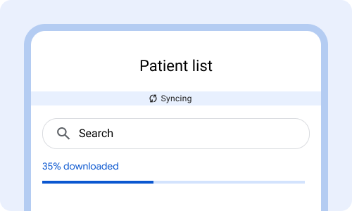

Do — Progress bar  
Loading bar that clearly shows that progress is happening.

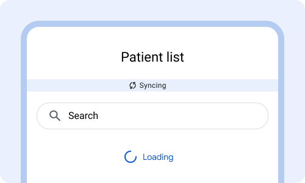

Don't — Spinning wheel  
Avoid a spinning loading wheel. It's unclear if it is stalled or making progress.

## Sync timestamps

Sync timestamps inform healthcare workers of when the information was last updated. Timestamps help healthcare workers:

1. Know if they are looking at the most up to date information.
2. Understand if the app is syncing and updating as expected.
3. Provide continuity of care by picking up where the previous healthcare worker left off.

Use time stamps sparingly and only display when critical, such as on task list or patient card.

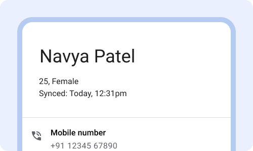

Do — Show relevant timestamps  
Show when information was last updated (and show it in context), to help people know if it's been too long since they've synced.

Don't — Show timestamps for all data  
Don't show timestamps for every piece of data, such as when the phone number was updated. Avoid a long list of what data was synced when. Showing too much time and date precision if it's been beyond 24 hours.

## Sync reminders

Sync reminders are displayed when the device has been offline for too long or the user needs to take action to sync the device.

Use reminders to communicate to users the need to sync the app and how to do it.

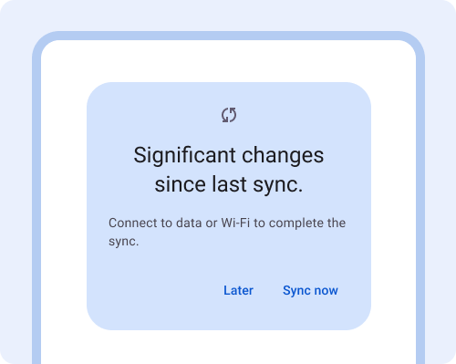

Do — Friendly reminder  
Remind people at a chosen interval to sync, when appropriate. Use a friendly tone when communicating the need to sync.

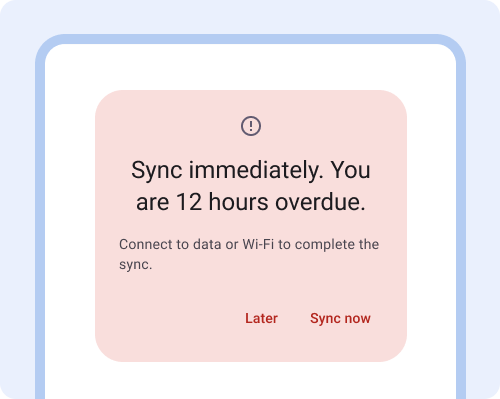

Don't — Be rude  
Avoid alarmist communication or making people feel bad that they haven't synced.

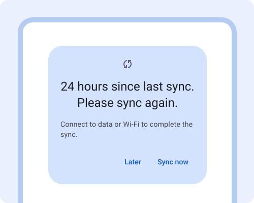

Do — Occasional reminders  
Remind people occasionally to sync their device, when it has gone beyond the threshold set for the type of healthcare setting (facility vs community).

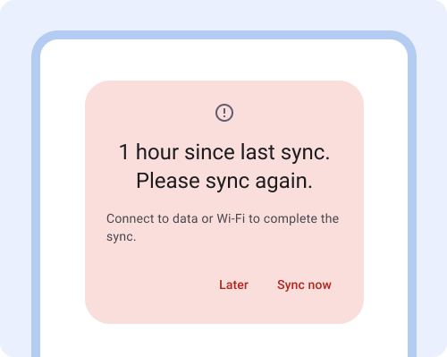

Don't — Send too many reminders  
Too many reminders can be annoying and can frustrate users. Only provide error messages when action is urgent.

## Manual sync

Manual sync overrides the default sync settings and allows users to sync now. This could be done through the manual sync page or directly on the patient card. The sync page shows when the last sync happened and when the next sync is scheduled for. Ideally the automatic sync intervals minimize the need for manual sync.

Manual sync can be useful for healthcare workers who are out in the community all day and want to sync when they are back home at night with better connectivity.

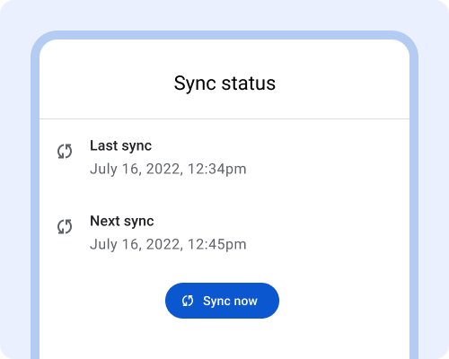

Do — Sync history  
On the manual sync page, show when the last sync happened, and when the next sync is scheduled for. Include a button to "sync now".

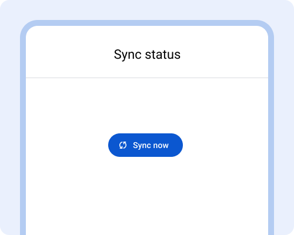

Don't — No sync history  
When there's no sync history, it's hard for healthcare workers to troubleshoot and to know what to expect.

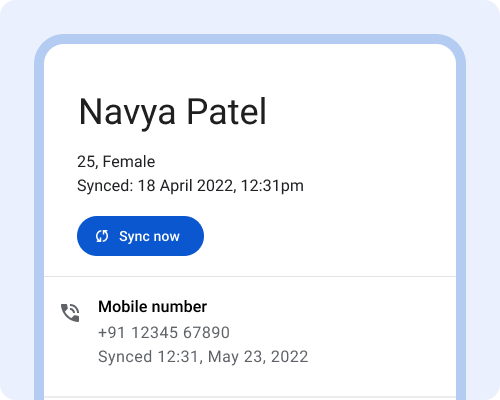

Do — Sync a specific patient  
When healthcare workers are handing off patients between each other, provide a way for them to immediately sync the patient record, by displaying a sync now button on the patient card. Alternatively, this can also be achieved with an event based sync.

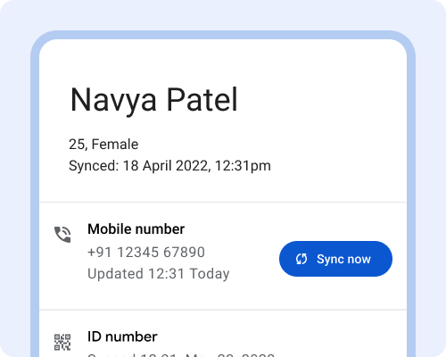

Don't — Granular data sync  
Avoid enabling users to select specific data to sync. It is too complex and too granular.

## Error messages & troubleshooting

Error messages appear when a function fails to complete, such as there are no patient's in the patient list.

Show the error message on the relevant screen. Help people troubleshoot by providing a clear description of what's not working and why. Then give instructions for how to solve the problem. If the first solution didn't work, provide a second set of instructions of what to try. Always provide additional ways for people to get help, through messaging or a phone call.

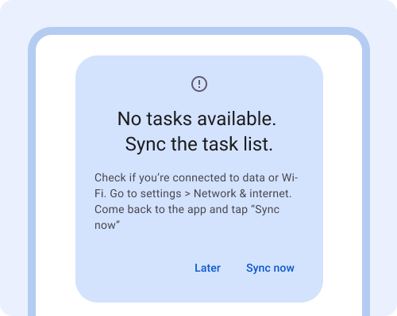

Do — Actionable error messages  
Use an error message that describes what is wrong and steps for how to fix it. Include directions on how to navigate system settings.

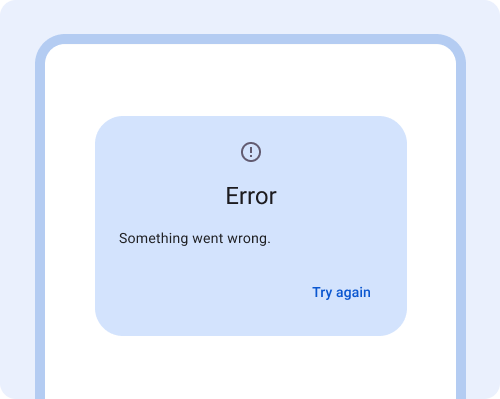

Don't — Unhelpful error messages  
Avoid generic error messages that don't explain what's wrong or provide suggestions for how to fix it.

Except as otherwise noted, the content of this page is licensed under the [Creative Commons Attribution 4.0 License](https://creativecommons.org/licenses/by/4.0/), and code samples are licensed under the [Apache 2.0 License](https://www.apache.org/licenses/LICENSE-2.0). For details, see the [Google Developers Site Policies](https://developers.google.com/site-policies). Java is a registered trademark of Oracle and/or its affiliates.

Last updated 2024-07-23 UTC.

[[["Easy to understand","easyToUnderstand","thumb-up"],["Solved my problem","solvedMyProblem","thumb-up"],["Other","otherUp","thumb-up"]],[["Missing the information I need","missingTheInformationINeed","thumb-down"],["Too complicated / too many steps","tooComplicatedTooManySteps","thumb-down"],["Out of date","outOfDate","thumb-down"],["Samples / code issue","samplesCodeIssue","thumb-down"],["Other","otherDown","thumb-down"]],["Last updated 2024-07-23 UTC."],[],["Offline-capable healthcare apps should prioritize offline-first design, enabling users to complete primary workflows without internet. Key actions include: initial sync with clear guidance and time estimates; a status bar indicating offline status, syncing, success, or failure; background syncing based on relevant intervals; progress indicators on key screens; timestamps for recent updates; and friendly sync reminders. Manual sync and actionable error messages are essential. The design must prioritize user workflow, and avoid too much details.\n"]]
