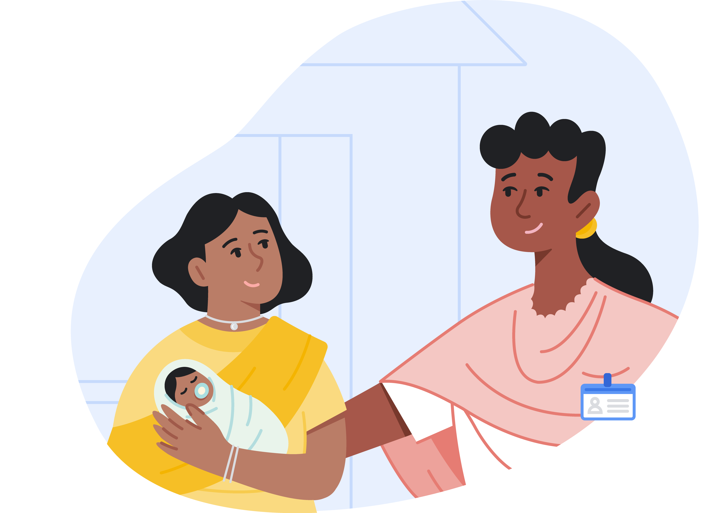
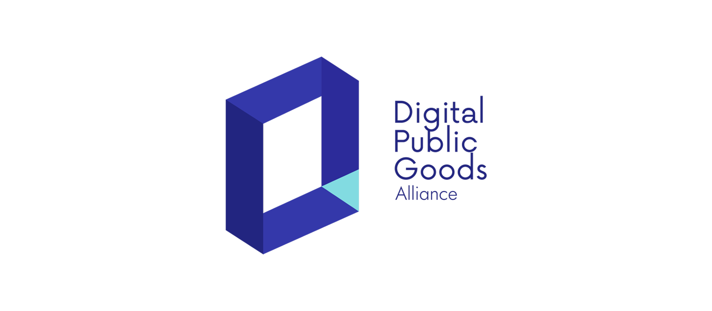
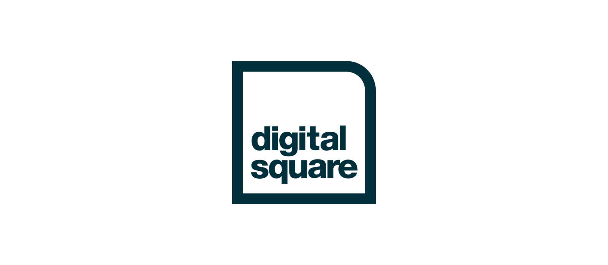
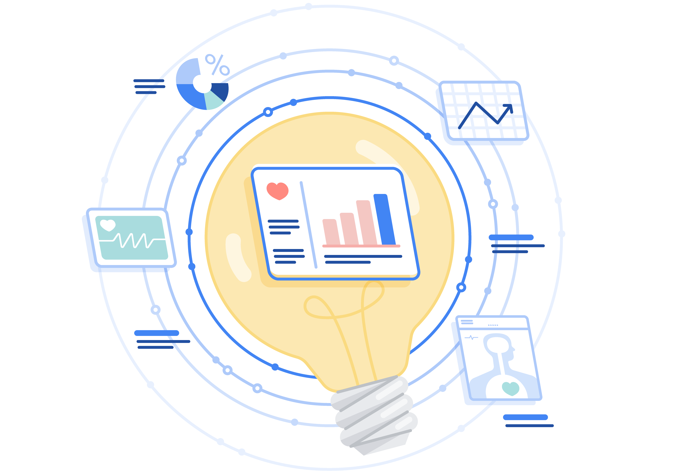
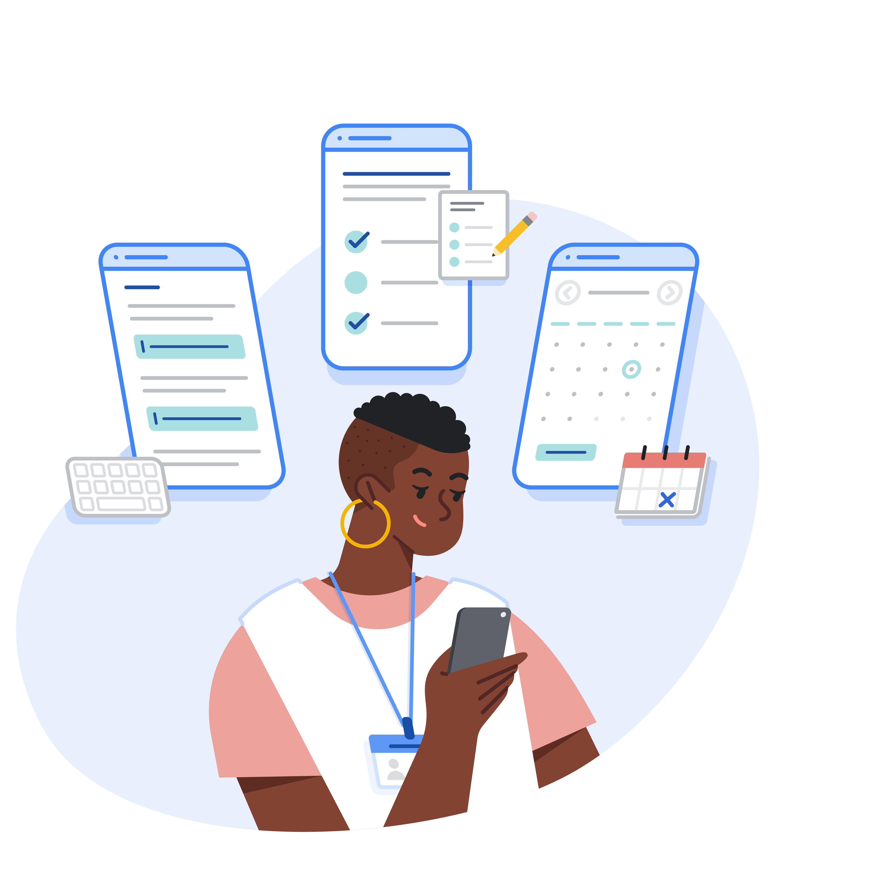
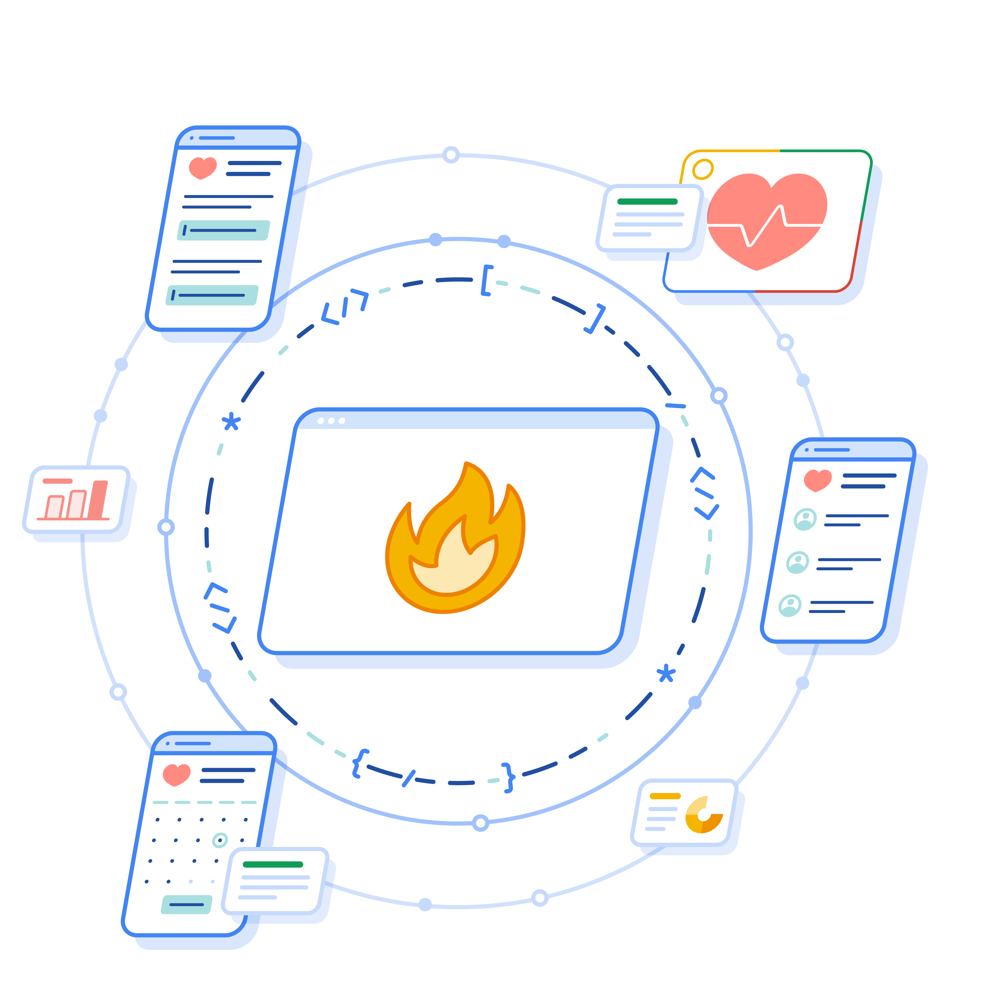
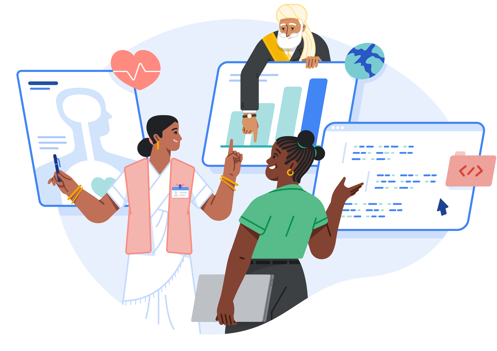
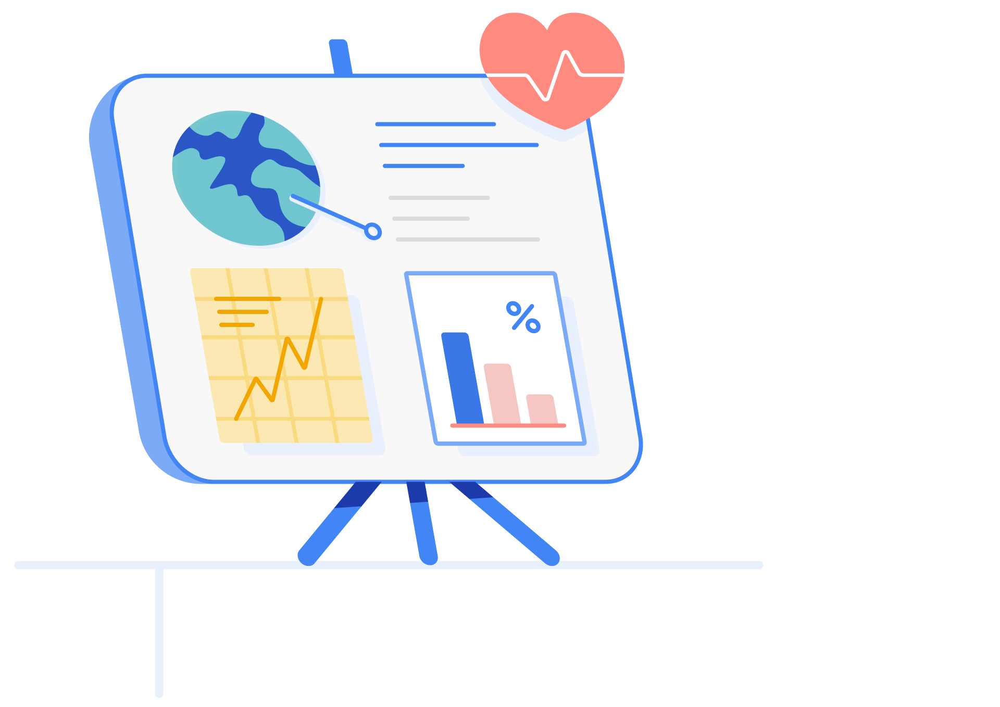

# Open Health Stack  |  Google for Developers

/\* Styles inlined from /open-health-stack/styles/ohs.css \*/
.ohs-padding-large-top {
padding-top: 96px !important;
}
.ohs-padding-large-bottom {
padding-bottom: 96px !important;
}
.ohs-padding-large {
padding-top: 96px !important;
padding-bottom: 96px !important;
}
.ohs-design-padding-top {
padding-top: 64px !important;
}
.ohs-design-padding-bottom {
padding-bottom: 40px !important;
}
.ohs-padding-xsmall-bottom {
padding-bottom: 32px !important;
}
.ohs-caption {
font-size: 0.875em;
}

### Accelerating the future of digital health

Open Health Stack provides building blocks for creating next-gen healthcare apps. These open source components save time and make it easier to adopt modern healthcare standards ([HL7® FHIR®](https://www.hl7.org/fhir/index.html)), leading to secure, offline-capable, data-driven solutions for healthcare workers in low-resource settings.

[Learn more](https://developers.google.com/open-health-stack/overview)

### Advancing SDGs as a 'Digital Public Good'

Open Health Stack was recently recognized as a [Digital Public Good](https://digitalpublicgoods.net/digital-public-goods/) by the Digital Public Goods Alliance. The goal of the DPGA is to promote digital public goods to create a more equitable world. We're excited to be recognized alongside other open source projects that advance the [Sustainable Development Goals](https://sdgs.un.org/goals).

### Recognized as a '[Global Good for Health](https://digitalsquare.org/blog/2023/2/16/digital-square-announces-new-software-global-goods-approved-through-notice-g)' by Digital Square

The Android FHIR SDK, a component of Open Health Stack, has been officially approved as a Digital Square Global Good for Health. We're thrilled to join this family of software digital goods that are impactful, scalable, and adaptable to different countries and contexts.

## Build next-gen digital health solutions

### Build faster

Access libraries designed to help you build FHIR-native Android apps that are secure, offline-capable, and provide on-device decision support enabling patient centered care delivery.

[arrow\_forward Explore Android FHIR SDK](https://developers.google.com/open-health-stack/android-fhir)

### Enhance privacy

Build privacy-preserving apps with the FHIR Info Gateway, ensuring safety by only allowing access to patient data for relevant healthcare workers.

[arrow\_forward Explore FHIR Info Gateway](https://developers.google.com/open-health-stack/fhir-info-gateway)

### Unlock insights

Transform data to make it easier to generate trusted insights faster, enabling more effective decision making across healthcare programs.

[arrow\_forward Explore FHIR Analytics](https://developers.google.com/open-health-stack/fhir-analytics)

## Unpack your new toolbox

### Access developer resources

[Get going quickly](/open-health-stack/learn) with developer documentation, tutorials, codelabs, and example applications.

### Design with best practices

Take a look at our [Design Guidelines](/open-health-stack/design) to help improve the user experience of your healthcare apps.

### Learn more about FHIR

Get a better understanding of [Fast Healthcare Interoperability Resources (FHIR)](/open-health-stack/resources/getting-started-with-fhir) and learn about the benefits for digital health.

## The Latest on OHS News

## Our principles empower developers to design, build, and deploy more effective digital health tools

### Open source

Access to tools and resources that accelerate adoption of open standards ([HL7 FHIR](https://www.hl7.org/fhir/index.html)) is key to driving organic and sustainable innovation for digital health.

### Community-oriented

Together we can enable more patient-focused, evidence-based care by empowering healthcare workers and health systems. [Get involved!](/open-health-stack/community)

### Impact-driven

By collaborating closely with our partners to track initiatives and impact, we get closer to our goal of improving health outcomes globally.

## Learn more about our work with the WHO

Katherine Chou, Senior Director of Google's Research and Innovation team, shares more about Google's [collaboration](https://blog.google/technology/health/working-who-power-digital-health-apps/) with the WHO, and how Open Health Stack components can help developers drive better health outcomes.

## We want to hear from you

Share feedback about your experience working with OHS. Send us an email at [hello-ohs@google.com](mailto:hello-ohs@google.com).

[[["Easy to understand","easyToUnderstand","thumb-up"],["Solved my problem","solvedMyProblem","thumb-up"],["Other","otherUp","thumb-up"]],[["Missing the information I need","missingTheInformationINeed","thumb-down"],["Too complicated / too many steps","tooComplicatedTooManySteps","thumb-down"],["Out of date","outOfDate","thumb-down"],["Samples / code issue","samplesCodeIssue","thumb-down"],["Other","otherDown","thumb-down"]],[],[],[]]
