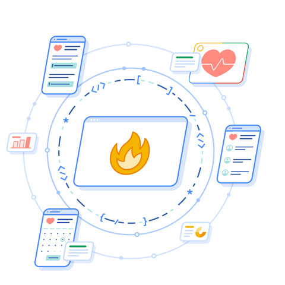

# Open Health Stack  |  Google for Developers

### Learn Open Health Stack with our video series

This video series provides an introduction to Open Health Stack, its core components, and key features. Start here to get a solid foundation in OHS.

### Open Health Stack overview

An introduction to Open Health Stack and its components. A great starting point for beginners.

### Android FHIR SDK

Learn how the Android FHIR SDK helps you leverage FHIR in your Android apps.

### Structured Data Capture Library

Learn how to use the Structured Data Capture Library to collect and manage structured data in your Android app.

### FHIR Engine Library

Learn how to build offline-first Android apps with the FHIR Engine Library.

### Workflow Library

Use the Workflow Library to drive on-device decision support and enable evidence-based care pathways with advanced CQL logic.

### Knowledge Manager Library

Learn how the Knowledge Manager Library can help you manage and deploy FHIR applications.

### FHIR Info Gateway

Learn how to enforce your organization's access control policies with the FHIR Info Gateway.

### FHIR Data Pipes (Analytics)

Learn how FHIR Data Pipes can help you easily deploy scalable data pipelines and generate insights from your FHIR data.

Except as otherwise noted, the content of this page is licensed under the [Creative Commons Attribution 4.0 License](https://creativecommons.org/licenses/by/4.0/), and code samples are licensed under the [Apache 2.0 License](https://www.apache.org/licenses/LICENSE-2.0). For details, see the [Google Developers Site Policies](https://developers.google.com/site-policies). Java is a registered trademark of Oracle and/or its affiliates.

Last updated 2024-11-28 UTC.

[[["Easy to understand","easyToUnderstand","thumb-up"],["Solved my problem","solvedMyProblem","thumb-up"],["Other","otherUp","thumb-up"]],[["Missing the information I need","missingTheInformationINeed","thumb-down"],["Too complicated / too many steps","tooComplicatedTooManySteps","thumb-down"],["Out of date","outOfDate","thumb-down"],["Samples / code issue","samplesCodeIssue","thumb-down"],["Other","otherDown","thumb-down"]],["Last updated 2024-11-28 UTC."],[],[]]
