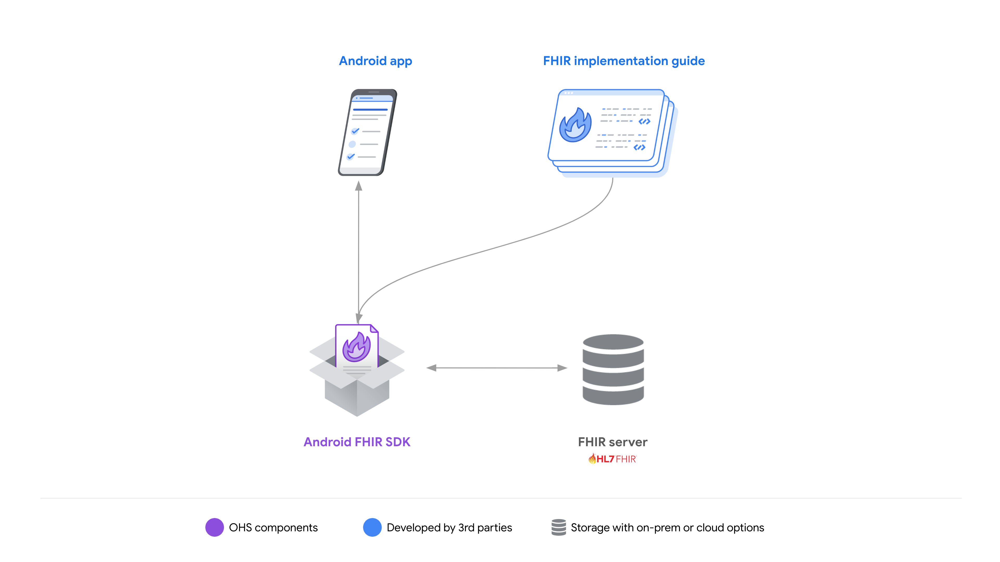
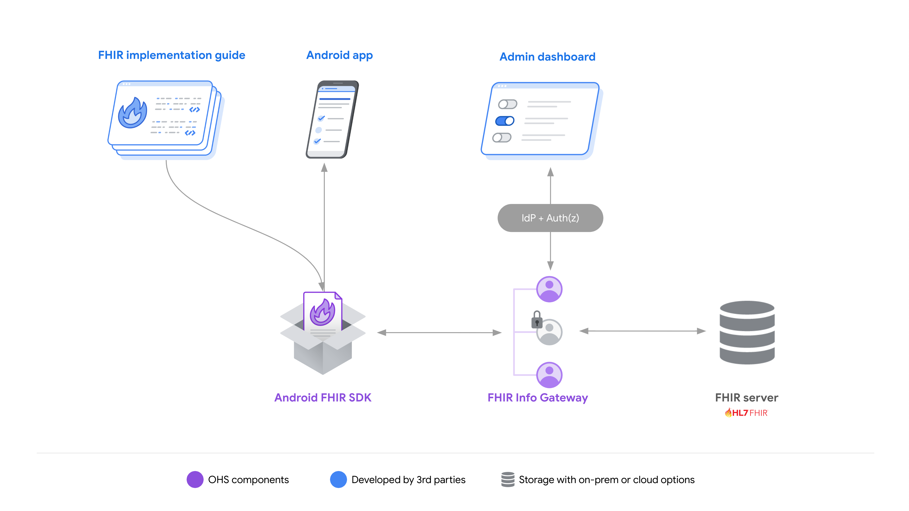
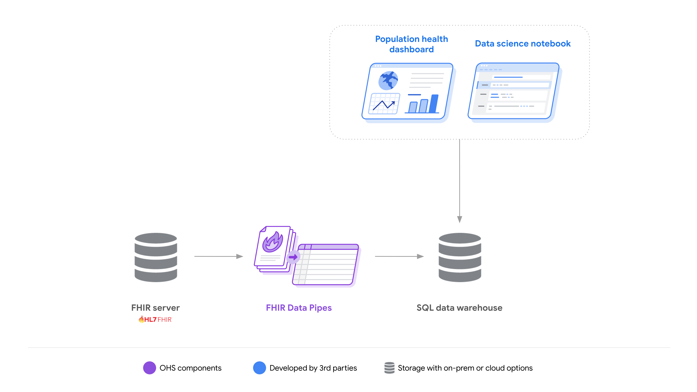
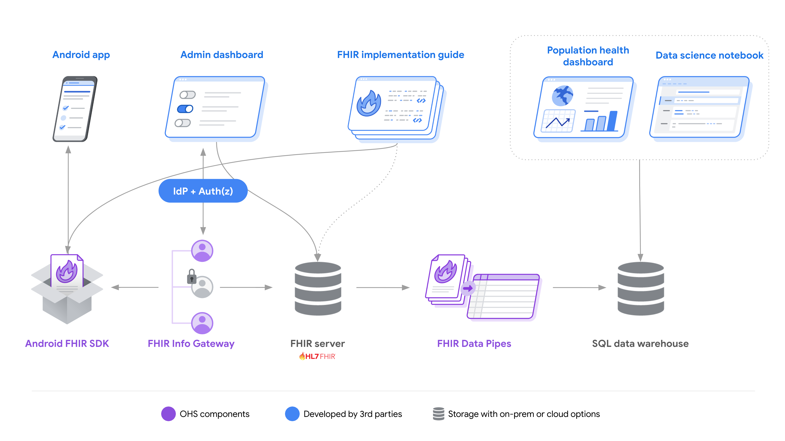
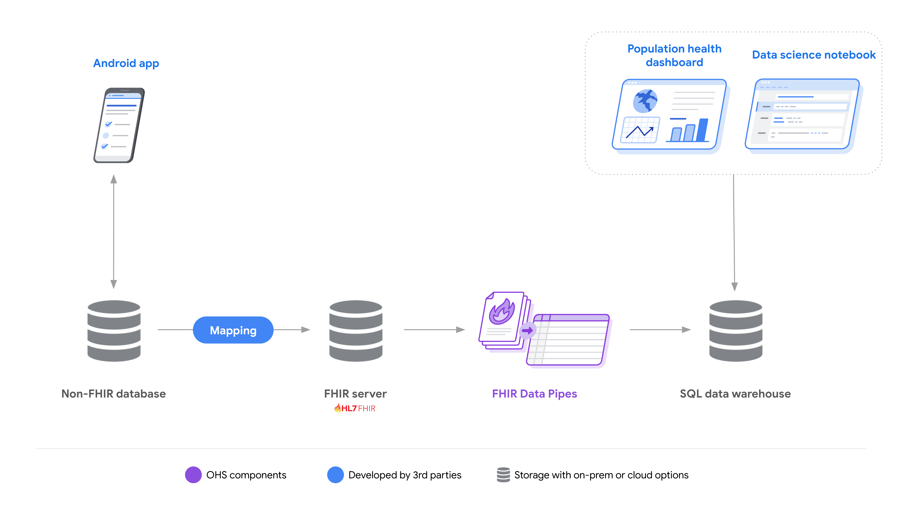

# Open Health Stack use cases  |  Google for Developers

# Open Health Stack use cases

## Page Summary

- Open Health Stack (OHS) components simplify FHIR adoption and can be used individually or combined for a comprehensive digital health platform.
- Developers can build offline-first Android FHIR apps using the Android FHIR SDK, featuring Structured Data Capture, FHIR Engine, and Workflow libraries.
- The FHIR Info Gateway enhances privacy and access control for FHIR applications, supporting SMART-on-FHIR integration.
- FHIR Data Pipes streamline FHIR analytics by transforming data into an SQL-on-FHIR format for easier querying.
- OHS components offer modularity, allowing integration with existing systems in hybrid architectures for data transformation and app development.

OHS components make it easier to adopt FHIR. You can use them separately or
combine them to form the foundation of an end-to-end digital health platform.

## FHIR-based Android apps

Using the [Android FHIR SDK](/open-health-stack/android-fhir), developers can
build FHIR native Android applications quickly. The SDK is a modular set of
libraries designed to provide flexibility for a range of different use cases.
These include using:

- the [Structured Data Capture
  Library](/open-health-stack/android-fhir/data-capture) in an existing
  application to enable data collection via FHIR,
- the [FHIR Engine Library](/open-health-stack/android-fhir/fhir-engine) to
  build offline first solutions on FHIR and,
- the advanced capabilities of the [Workflow
  Library](/open-health-stack/android-fhir/workflow) to enable CQL-based
  clinical decision support from WHO Smart Guidelines content.

**Resources**:

- Get started quickly with the [SDC
  codelab](/open-health-stack/codelabs/data-capture).
- [Read](/open-health-stack/stories) about how developers are building mobile
  solutions with OHS.

## Enhancing privacy, leveraging SMART-on-FHIR

The [FHIR Info Gateway](/open-health-stack/fhir-info-gateway) is a stand-alone
reverse proxy that you can deploy in front of any application to enhance privacy
and make it easier to implement organizational access control policies. When
used together with an Android FHIR SDK powered application the Info Gateway can
also enhance sync operations, for example, to limit the patient data that a
specific health worker can download and access when working offline.

As a stand-alone proxy, the Info Gateway supports integration with SMART-on-FHIR
applications.

**Resources**:

- Explore the [FHIR app examples
  repository](https://github.com/ohs-foundation/fhir-app-examples) to see
  how the FHIR Info Gateway can be used with other OHS components.

## FHIR Analytics Solutions

Due to the heavily nested structure of FHIR data, writing queries to generate
insights can be challenging. [FHIR Data
Pipes](/open-health-stack/fhir-analytics/data-pipes) simplify the problem with
an easily deployable and horizontally scalable pipeline that transforms FHIR
data into an [SQL-on-FHIR
format](https://github.com/FHIR/sql-on-fhir), making it possible to
query FHIR Data via SQL.

FHIR Data Pipes can be helpful where FHIR is the source of the data to be
analyzed. Common scenarios for developers include:

1. As an extension of a FHIR native mobile health solution - [see foundations
   for an end-to-end digital health
   solution](#foundations_for_an_end-to-end_digital_health_solution).
2. As part of a stand-alone analytics solution that is leveraging FHIR - [see
   hybrid architecture example](#hybrid_architecture_example).

**Resources**:

- Get started quickly with the [single machine deployment
  tutorial](https://github.com/ohs-foundation/fhir-data-pipes/wiki/Analytics-on-a-single-machine-using-Docker).
- Explore the [FHIR app examples
  repository](https://github.com/ohs-foundation/fhir-app-examples) to
  see how the FHIR Data Pipes can be used with other OHS components.

## Foundations for an end-to-end digital health solution

Using all of the OHS components together provides a foundation for developers to
build FHIR based platforms or solutions. By providing a number of core
features—like sync and offline capabilities—and reducing the technical
complexity of working with FHIR, developers can save significant time and focus
more on the value-add of their solutions.

**Resources**:

- Explore the [FHIR app examples
  repository](https://github.com/ohs-foundation/fhir-app-examples) to see
  how all of the components can be used together.
- [Read about how Ona has used OHS](/open-health-stack/stories/ona) to build
  OpenSRP FHIRCore.

## Hybrid Architecture Example

OHS component modularity lets developers pick and choose the pieces that best
help them solve specific problems.

There are many examples of where it could be beneficial to transition a part of
an existing system to FHIR while maintaining other parts of the solution as they
are. These include:

1. *Non-FHIR data collection to FHIR based analytics*: In this scenario, data
   collected in a non-FHIR way is transformed into FHIR to enable the use of
   the OHS FHIR Data Pipes for a common approach to generating insights from
   FHIR data. To transform data, developers can use existing vendor APIs,
   existing third party services such as the [Global
   Goods](https://digitalsquare.org/blog/2023/2/16/digital-square-announces-new-software-global-goods-approved-through-notice-g)
   approved [OpenFn](http://openfn.org) or leverage relevant [open
   source
   projects](https://github.com/GoogleCloudPlatform/healthcare-data-harmonization).
2. *FHIR Native app to Non-FHIR Systems*: In this scenario, a FHIR native
   mobile app built using the Android FHIR SDK is used for offline care
   delivery with data synced to a FHIR Server. From the FHIR server developers
   could implement integrations with existing systems, third party adapters or
   custom code.

**Resources**:

- Explore the [FHIR app examples
  repository](https://github.com/ohs-foundation/fhir-app-examples) to see
  how all of the components can be used together.

Except as otherwise noted, the content of this page is licensed under the [Creative Commons Attribution 4.0 License](https://creativecommons.org/licenses/by/4.0/), and code samples are licensed under the [Apache 2.0 License](https://www.apache.org/licenses/LICENSE-2.0). For details, see the [Google Developers Site Policies](https://developers.google.com/site-policies). Java is a registered trademark of Oracle and/or its affiliates.

Last updated 2026-05-15 UTC.

[[["Easy to understand","easyToUnderstand","thumb-up"],["Solved my problem","solvedMyProblem","thumb-up"],["Other","otherUp","thumb-up"]],[["Missing the information I need","missingTheInformationINeed","thumb-down"],["Too complicated / too many steps","tooComplicatedTooManySteps","thumb-down"],["Out of date","outOfDate","thumb-down"],["Samples / code issue","samplesCodeIssue","thumb-down"],["Other","otherDown","thumb-down"]],["Last updated 2026-05-15 UTC."],[],["The OHS (Open Health Stack) enables FHIR adoption through modular components. Developers can use the Android FHIR SDK to build FHIR-based apps, leveraging libraries for data capture, offline solutions, and clinical decision support. The FHIR Info Gateway enhances privacy and access control. FHIR Data Pipes transforms FHIR data into SQL for simplified analysis, supporting both end-to-end and hybrid solutions. These components enable building complete FHIR platforms or integrating FHIR into existing systems.\n"]]
