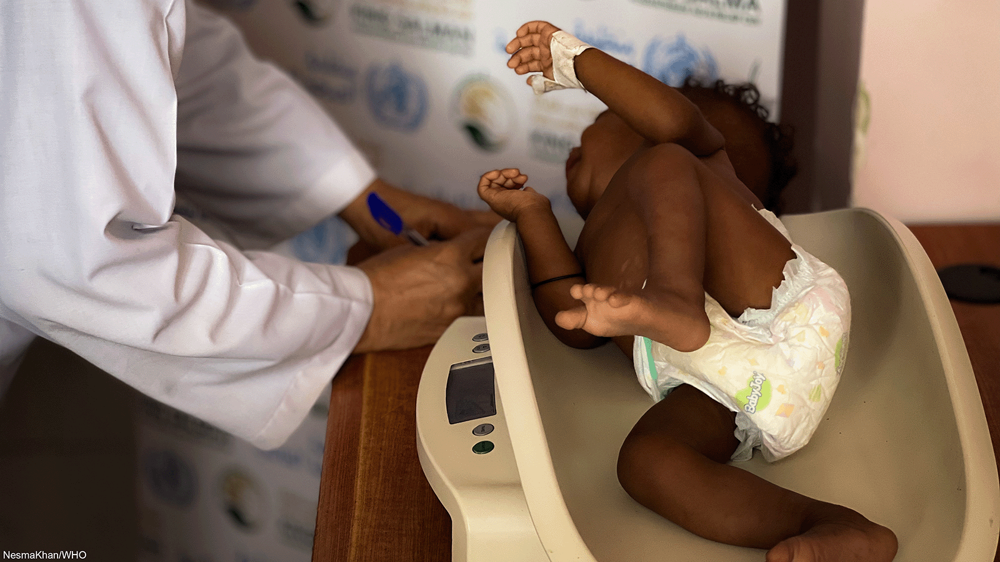
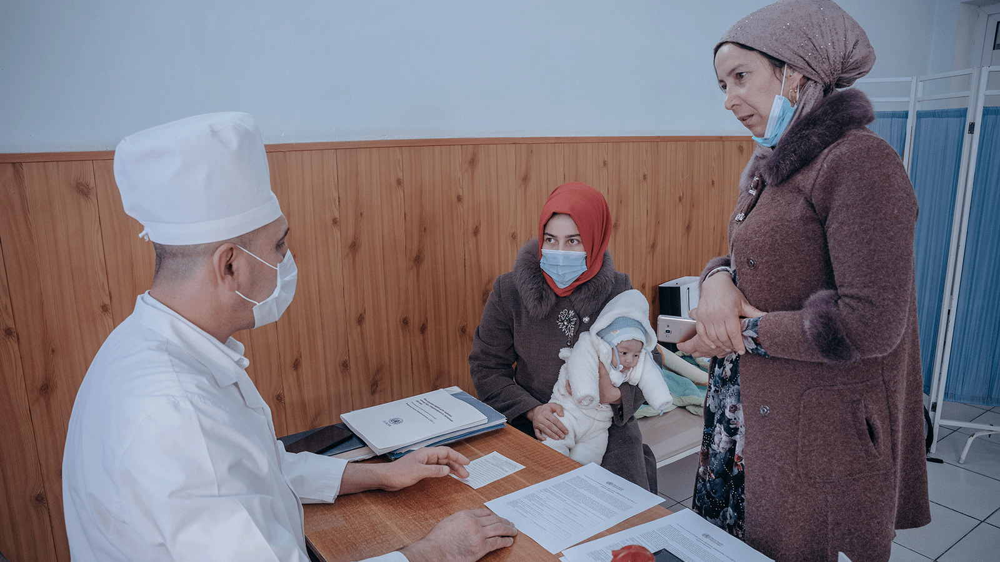
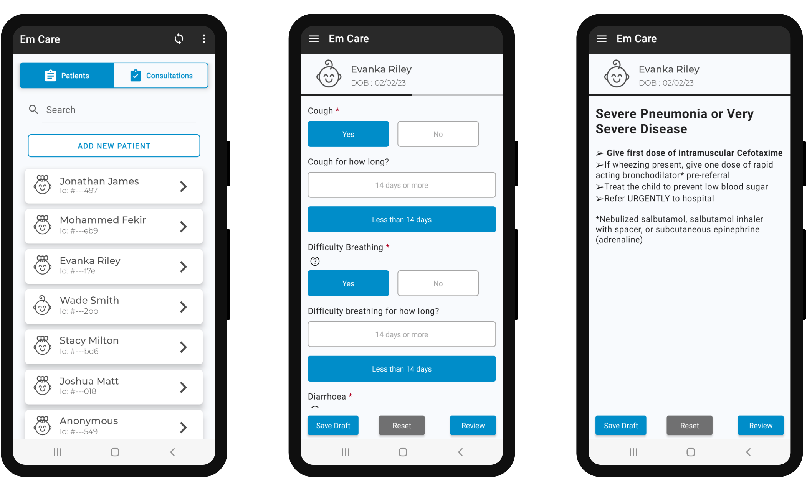

# Open Health Stack  |  Google for Developers

/\* Styles inlined from /open-health-stack/styles/ohs.css \*/
.ohs-padding-large-top {
padding-top: 96px !important;
}
.ohs-padding-large-bottom {
padding-bottom: 96px !important;
}
.ohs-padding-large {
padding-top: 96px !important;
padding-bottom: 96px !important;
}
.ohs-design-padding-top {
padding-top: 64px !important;
}
.ohs-design-padding-bottom {
padding-bottom: 40px !important;
}
.ohs-padding-xsmall-bottom {
padding-bottom: 32px !important;
}
.ohs-caption {
font-size: 0.875em;
}

## WHO puts SMART Guidelines into action in emergency settings

North Darfur, Sudan, at the opening of a village health center. With 2.5 million internally displaced people in Sudan, there is an urgent need to strengthen basic services.

### Context

Emergency settings create unique challenges for care delivery. Healthcare workers must manage a high volume of patients and make decisions under intense pressure. Supporting emergency care response is a priority for the WHO, especially in the WHO Africa and Eastern Mediterranean regions.

WHO publishes practice guidelines that can help to deliver evidence-based care in these settings. However, these guidelines are in static pdf formats that are hard to rapidly deploy in the field. It is also challenging to adapt these guidelines to local contexts and rapidly changing crisis environments.

### Solution

WHO launched the Em Care project\* to develop a digital solution that implements the [WHO's SMART Guidelines](https://www.who.int/teams/digital-health-and-innovation/smart-guidelines) for newborn and child health in emergency settings. Developed in partnership with Argusoft India Ltd., the app will initially be piloted in Iraq and Cameroon to support front-line health workers to deliver evidence-based care in primary health care facilities.

Em Care is a fully open-source, FHIR-native solution that can be configured to meet country- or site-specific requirements and integrated to Member State's existing digital solutions. It is available for Android devices and built using the Android FHIR SDK which supports HL7 FHIR®/CQL. It will be available from the Google Play store or as a direct download to an Android Package Kit (APK). The executable content has been authored as a FHIR Implementation Guide (IG), with support from a team at Swiss TPH, and is available from the [WHO GitHub account](https://github.com/WorldHealthOrganization/smart-emcare).

## "SMART Guidelines are a game-changer in how a digital ecosystem of different actors can collaborate to make trusted content available, ensure the digitalization of evidence-based guidelines with high fidelity, and engage local developers to build, support and maintain technologies."

Dr. Alain Labrique - Director, Digital Health and Innovation, WHO

Therapeutic Feeding Centre, Yemen.

Maternal and child mission, Tajikistan.

### How OHS helped

The Em Care reference software was built using Open Health Stack's Android FHIR SDK, using multiple core SDK libraries and a common data model based on HAPI FHIR. This has not only saved time, but also helped reduce development costs.

The Structured Data Capture (SDC) library has allowed questionnaires to be rapidly turned into data collection forms, using standardized UI widgets that promote the collection of quality data in a consistent way. Integrations with FHIRPath and CQL have allowed the implementation of decision logic to automatically propose diagnoses for which the child meets recommended criteria, and advanced form behaviors such as automatic calculation of anthropometric z-scores. The workflow library has also helped to model the decision logic in the application so that it reflects the workflows of frontline health workers.

The project also includes a web-based application, which permits data to be synchronized back to a central server and visualized in dashboards to inform decision making at district and national levels. The analysis of data mapped to the FHIR standard can prove challenging due to its heavily nested structure, and Argusoft are working closely with Open Health Stack to leverage FHIR Analytics to support this area of work.

Not real patient information.

## “The Android FHIR SDK has been fundamental in saving a lot of development time for the Em Care Android application. The components like FHIR Engine, Workflow Library, and SDC Library come up with a lot of utility code that prevents from writing the boiler plate code and helps in implementing functional logic of the app.”

Kunjan Patel - Group Lead, Argusoft India Ltd.

### Next steps

Em Care will be deployed in two emergency settings (Iraq and Cameroon) in Spring 2023. Beyond this, there will be expansion to other pilot countries and development of broader clinical content to include other age groups and health conditions.

*\*EM Care is a joint collaboration between the WHO Health Emergencies Programme (WHE) and the WHO Departments of Maternal, Newborn, Child and Adolescent Health and Ageing (MCA); Nutrition and Food Safety (NFS); Digital Health and Innovation (DHI) and Information Management and Technology (IMT).*

Except as otherwise noted, the content of this page is licensed under the [Creative Commons Attribution 4.0 License](https://creativecommons.org/licenses/by/4.0/), and code samples are licensed under the [Apache 2.0 License](https://www.apache.org/licenses/LICENSE-2.0). For details, see the [Google Developers Site Policies](https://developers.google.com/site-policies). Java is a registered trademark of Oracle and/or its affiliates.

Last updated 2024-11-28 UTC.

[[["Easy to understand","easyToUnderstand","thumb-up"],["Solved my problem","solvedMyProblem","thumb-up"],["Other","otherUp","thumb-up"]],[["Missing the information I need","missingTheInformationINeed","thumb-down"],["Too complicated / too many steps","tooComplicatedTooManySteps","thumb-down"],["Out of date","outOfDate","thumb-down"],["Samples / code issue","samplesCodeIssue","thumb-down"],["Other","otherDown","thumb-down"]],["Last updated 2024-11-28 UTC."],[],[]]
