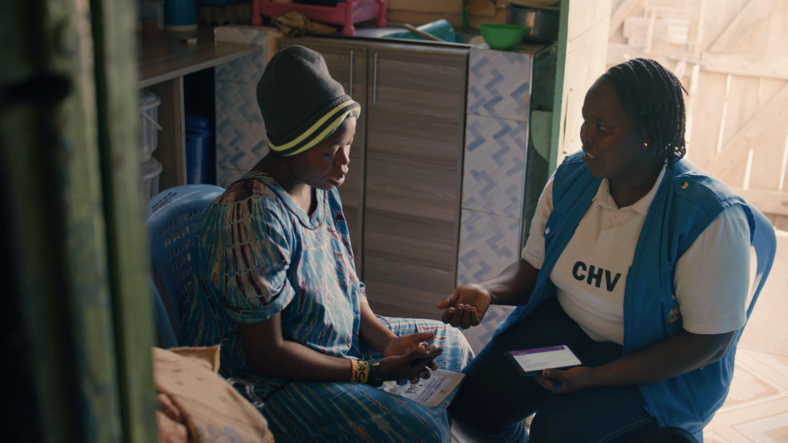
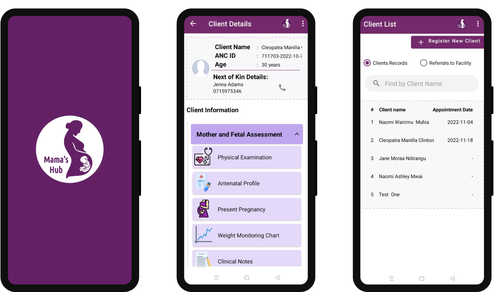

# Open Health Stack  |  Google for Developers

/\* Styles inlined from /open-health-stack/styles/ohs.css \*/
.ohs-padding-large-top {
padding-top: 96px !important;
}
.ohs-padding-large-bottom {
padding-bottom: 96px !important;
}
.ohs-padding-large {
padding-top: 96px !important;
padding-bottom: 96px !important;
}
.ohs-design-padding-top {
padding-top: 64px !important;
}
.ohs-design-padding-bottom {
padding-bottom: 40px !important;
}
.ohs-padding-xsmall-bottom {
padding-bottom: 32px !important;
}
.ohs-caption {
font-size: 0.875em;
}

## IntelliSOFT reduces development time for a maternal care app in Kenya

Stellah, a community health volunteer in Nakuru County, Kenya, talks to an expectant mother during a routine visit. Stellah uses the Mama's Hub app to track patient information in a digital format.

### Context

In Kenya, the vast majority of antenatal care (ANC) records are kept on paper in the ‘Mother & Child Health Handbook'. Paper records can be lost or are difficult to read and do not lend themselves to an easy flow of information through the health system. This can result in fragmented care for many expectant mothers.

### Solution

IntelliSOFT developed an app called 'Mama's Hub', powered by Open Health Stack's Android FHIR SDK, in collaboration with a consortium of partners including Kabarak and Strathmore Universities, the Technical University of Mombasa and e-Med Solutions. Mama's Hub allows community health workers to record details from an antenatal encounter on an Android smartphone and generate electronic referrals to a health facility. This begins a connected journey where the mother, clinic, community health worker, and even trusted family members are able to access the appropriate information through Mama's Hub.

### How OHS helped

Open Health Stack helped IntelliSOFT to build the first version of this application in under 3 months (versus an estimated 9 months to build from scratch). Instead of dealing with foundational app infrastructure, IntelliSOFT was able to focus on building unique value-adding features for their patient population like integrating blood pressure readings. Since the app is based on the FHIR standard and is offline-capable, the information is stored securely in a way that can be accessed by different clinics or different applications.

### Impact

Mama's Hub is currently in the pilot phase, with over 50 registered nurses and community health workers using the tool, and a growing number of mothers registered and referred. Digitizing the previously paper-based records means that the health facility and Ministry of Health can view real-time information about referral flows and case-mix. Having a digital referral form (that can be adapted easily) also ensures that the quality of referrals is consistent across the region. The healthcare providers are able to access the client's information with ease and can make informed decisions on the mother's continuum of care.

## "Mama's Hub has enabled administrators to obtain the cumulative data from the community health units and health facilities instantly unlike when relying on manual records."

- Dr. Moses Thiga, Founder of Mama's Hub

Not real patient information.

### Next steps

The goal is to completely digitize the Mother & Child Health Handbook into Mama's Hub. The app will then include Postnatal Care workflows and advice. There is also a plan to integrate WHO SMART Guidelines [content](https://www.who.int/teams/digital-health-and-innovation/smart-guidelines) for antenatal care and to integrate with the electronic Community Health Information System. Long term, IntelliSOFT will build out a holistic digital view of the patient's journey (both mother & child) through antenatal, postnatal, newborn care & immunization.

Except as otherwise noted, the content of this page is licensed under the [Creative Commons Attribution 4.0 License](https://creativecommons.org/licenses/by/4.0/), and code samples are licensed under the [Apache 2.0 License](https://www.apache.org/licenses/LICENSE-2.0). For details, see the [Google Developers Site Policies](https://developers.google.com/site-policies). Java is a registered trademark of Oracle and/or its affiliates.

Last updated 2024-11-28 UTC.

[[["Easy to understand","easyToUnderstand","thumb-up"],["Solved my problem","solvedMyProblem","thumb-up"],["Other","otherUp","thumb-up"]],[["Missing the information I need","missingTheInformationINeed","thumb-down"],["Too complicated / too many steps","tooComplicatedTooManySteps","thumb-down"],["Out of date","outOfDate","thumb-down"],["Samples / code issue","samplesCodeIssue","thumb-down"],["Other","otherDown","thumb-down"]],["Last updated 2024-11-28 UTC."],[],[]]
