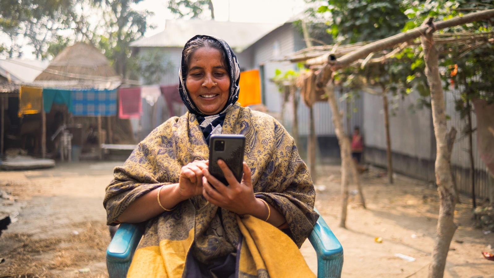
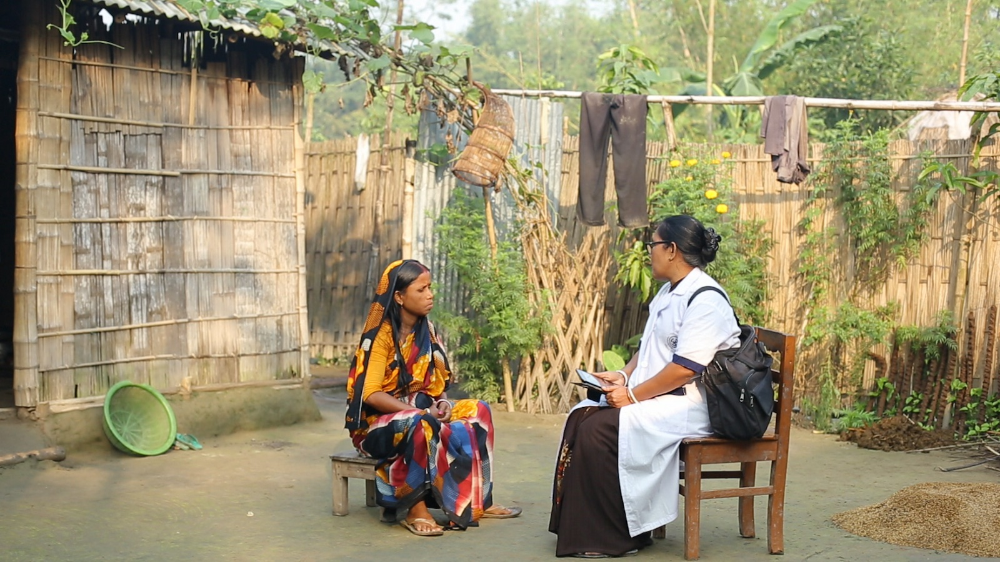
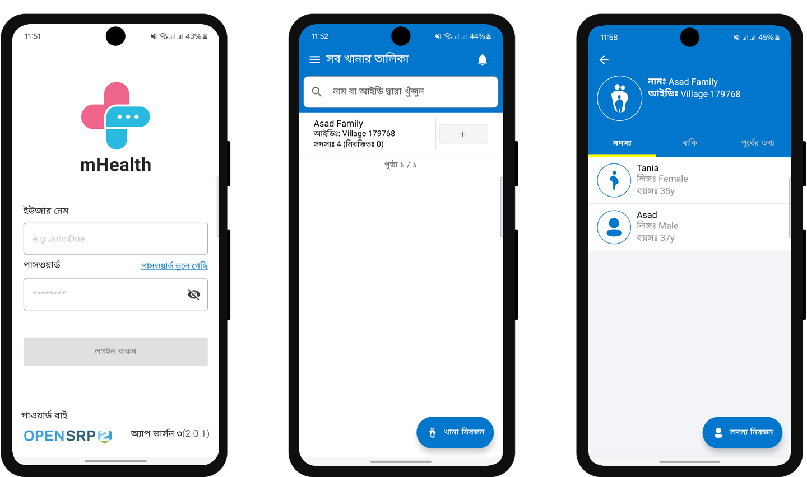

# Open Health Stack  |  Google for Developers

/\* Styles inlined from /open-health-stack/styles/ohs.css \*/
.ohs-padding-large-top {
padding-top: 96px !important;
}
.ohs-padding-large-bottom {
padding-bottom: 96px !important;
}
.ohs-padding-large {
padding-top: 96px !important;
padding-bottom: 96px !important;
}
.ohs-design-padding-top {
padding-top: 64px !important;
}
.ohs-design-padding-bottom {
padding-bottom: 40px !important;
}
.ohs-padding-xsmall-bottom {
padding-bottom: 32px !important;
}
.ohs-caption {
font-size: 0.875em;
}

## Optimizing Performance for Scaling a FHIR-based App in Bangladesh

This dedicated community health worker travels through rural Bangladesh
to deliver vital maternal health care. Her work exemplifies the dedication toproviding
underserved communities with necessary healthcare services.

### Context

The current BRAC mHealth system in Bangladesh is one of the largest community health workers (CHW)-based mHealth deployments in the world. The system is used by 4,500 CHWs and 1,500 other healthcare providers serving over 90 million beneficiaries across 64 districts and over 540 million service data points. Recent initiatives by the Bangladesh government have pushed for a standardization of health information systems to establish longitudinal tracking and improve quality of care for its citizens. BRAC’s Health, Nutrition, and Population Program (HNPP) led the efforts to upgrade the existing platform to a FHIR-compliant system. The key challenge faced in this project was optimizing the performance of the FHIR app to handle large data volumes from the nationally scaled mHealth system. The BRAC team had to ensure the FHIR app could meet the performance metrics of Health while being able to handle similar data burdens in government systems without compromising on performance.

### Solution

Parameters for performance optimization were identified, including average load times for households, patients and services, along with pagination for patient lists. Under Bangladesh's context, mPower baseline criteria for each device included providing support for 5,000 households, 20,000 members, 19,000 service data.
Patient search queries at higher patient volumes were contributing to slow performance. To address the need for performance optimization at a large scale, mPower worked closely with the Open Health Stack and Ona teams to build enhancements into the Android FHIR SDK that is integrated into Ona’s OpenSRP FHIR app (used in the BRAC Health Program).

Community health worker's equipped with the mHealth tool give personalized advice to mothers at the doorstep. These interactions bridge technology and health care delivery in a much more efficient way, ensuring informed decisions for better maternal and child health outcomes.

### How OHS helped

Ona’s OpenSRP FHIR app is built using the Android FHIR SDK which provides a lot of the core functionality such as offline data storage and APIs for data access, search and syncing. By leveraging the OpenSRP platform built on OHS, and the OpenSRP community, the mPower team were able to quickly build an initial proof-of-concept that they could use to evaluate the performance characteristics and identify bottlenecks. This saved the team considerable time and resources. By working closely with the Open Health Stack and Ona teams, fixes were identified, and the app optimized to handle large volumes of data in a performant manner.

## "Collaborating with the OHS community revolutionized our mHealth system, enabling us to handle vast data volumes with FHIR-compliant efficiency. The Android FHIR SDK accelerated development, enhanced scalability, and strengthened healthcare delivery, ensuring better service quality for millions across Bangladesh."

- Zaki Haider, Chief Innovations Officer, mPower Social Enterprises Ltd, Bangladesh

Not real patient information. OpenSRP app translated into Bangla, with content relevant workflows eabled

### Impact

Following the feature upgrade to the Android FHIR SDK, the performance metrics improved on average by a factor of **35x for households and services, 3.5x for patients, and 8x for pagination** - a meaningful performance improvement for the management of data and service load for a population of 950Million. These fixes, now part of the core Android FHIR SDK demonstrate the ability to scale to handle very large populations.

### Next steps

By the end of 2024, BRAC with the support of its government stakeholders and funders will be piloting the FHIR-based app in select areas in Bangladesh targeting 400K beneficiaries. Meanwhile, the Google Open Health Stack team will continue to work with the mPower team to monitor and address needs for further improvements once in production.

[[["Easy to understand","easyToUnderstand","thumb-up"],["Solved my problem","solvedMyProblem","thumb-up"],["Other","otherUp","thumb-up"]],[["Missing the information I need","missingTheInformationINeed","thumb-down"],["Too complicated / too many steps","tooComplicatedTooManySteps","thumb-down"],["Out of date","outOfDate","thumb-down"],["Samples / code issue","samplesCodeIssue","thumb-down"],["Other","otherDown","thumb-down"]],[],[],[]]
