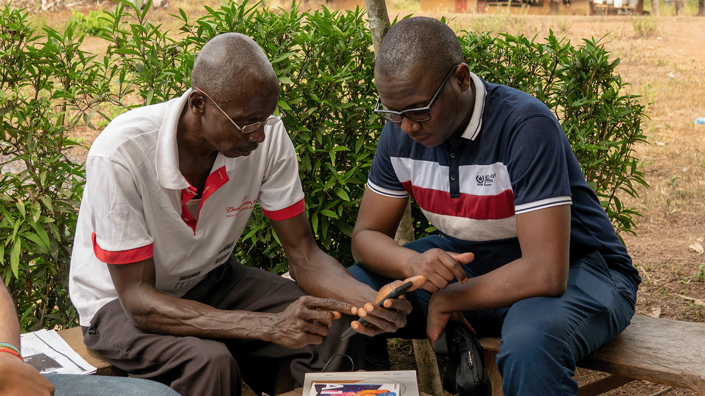
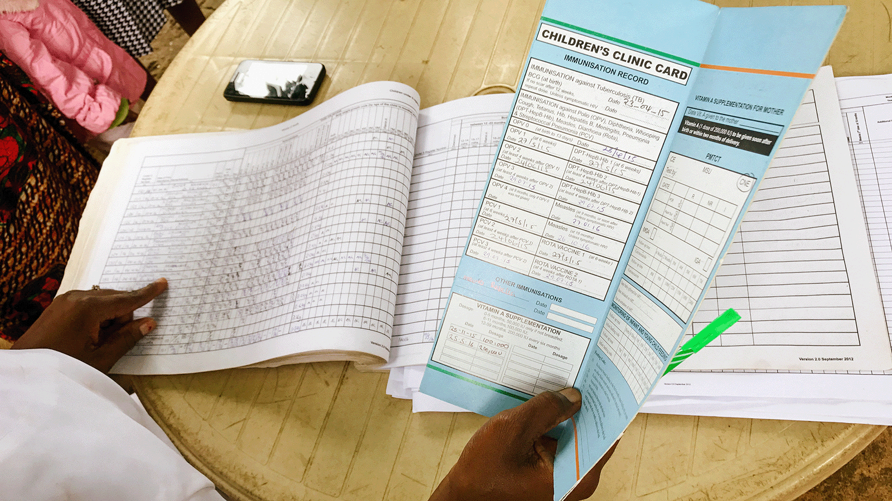
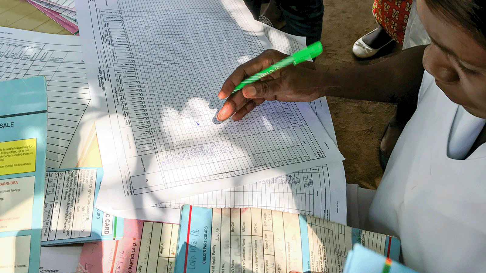

# Open Health Stack  |  Google for Developers

/\* Styles inlined from /open-health-stack/styles/ohs.css \*/
.ohs-padding-large-top {
padding-top: 96px !important;
}
.ohs-padding-large-bottom {
padding-bottom: 96px !important;
}
.ohs-padding-large {
padding-top: 96px !important;
padding-bottom: 96px !important;
}
.ohs-design-padding-top {
padding-top: 64px !important;
}
.ohs-design-padding-bottom {
padding-bottom: 40px !important;
}
.ohs-padding-xsmall-bottom {
padding-bottom: 32px !important;
}
.ohs-caption {
font-size: 0.875em;
}

## Ona rebuilds the OpenSRP platform to be FHIR native

The Ona team often travels to the field, speaking to community health workers to continuously shape and improve OpenSRP.

### Context

For many years, Ona has been empowering a global network of digital health projects with the OpenSRP platform - a lightweight, configurable electronic health record platform designed for use by frontline health workers in low connectivity environments. OpenSRP is used throughout the world, including in Brazil, Liberia, Malawi, Pakistan, Thailand, for a diverse range of use-cases. Historically, it has been challenging to connect OpenSRP to other existing health databases and enable coordinated care across a multi-stakeholder health system.

### Solution

Ona rebuilt OpenSRP from the ground up to be FHIR native. The re-factored OpenSRP uses a FHIR API to store configuration and health data, allowing developers to rapidly iterate and customize health workflows. FHIR content, such as WHO SMART Guidelines, can be loaded in dynamically rather than having to hard-code clinical workflows. OpenSRP integrates with a compatible Identity and Access Management API to provide FHIR-linked user accounts, and mirrors information to a data warehouse that powers dashboards and ad-hoc queries.

Before OpenSRP, the same information would be written multiple times in different places and not accessed unless a written update was needed. OpenSRP digitalizes this data, encouraging its active use in patient care, and making it shareable for team-based care, including in outreach, planning, and training.

### How OHS helped

Open Health Stack allowed Ona to build a platform entirely within the FHIR ecosystem. OpenSRP uses the Android FHIR SDK to support syncing, workflows, and data capture; the FHIR Info Gateway to mediate permissions between our Identity and Access Management system and our FHIR data store; and FHIR Analytics to transform FHIR documents into relational tables for [visualization and querying](https://akuko.io/). This enables Ona and their partners to turn around prototype apps in days, with industrial-strength tools that scale for use in national health systems.

## "OHS provides us with the foundational components required to rapidly iterate on a mobile FHIR platform that is ready for scale"

-The Ona Team

Not real patient information.

### Impact

After rebuilding OpenSRP on top of Open Health Stack, Ona reduced prototype development time from a couple months to a matter of weeks. OpenSRP enables live editing of apps through updates to dynamic content - changes that would have taken days to weeks of development time.

### Next steps

In 2023, OpenSRP is being rolled out to over 5,000 healthcare workers at district and national-level deployments in Indonesia, Liberia, and other countries. Ona continues to actively contribute to the Open Health Stack on Github and is particularly excited to work together on the Android FHIR SDK's support for Implementation Guides.

Except as otherwise noted, the content of this page is licensed under the [Creative Commons Attribution 4.0 License](https://creativecommons.org/licenses/by/4.0/), and code samples are licensed under the [Apache 2.0 License](https://www.apache.org/licenses/LICENSE-2.0). For details, see the [Google Developers Site Policies](https://developers.google.com/site-policies). Java is a registered trademark of Oracle and/or its affiliates.

Last updated 2024-11-28 UTC.

[[["Easy to understand","easyToUnderstand","thumb-up"],["Solved my problem","solvedMyProblem","thumb-up"],["Other","otherUp","thumb-up"]],[["Missing the information I need","missingTheInformationINeed","thumb-down"],["Too complicated / too many steps","tooComplicatedTooManySteps","thumb-down"],["Out of date","outOfDate","thumb-down"],["Samples / code issue","samplesCodeIssue","thumb-down"],["Other","otherDown","thumb-down"]],["Last updated 2024-11-28 UTC."],[],[]]
