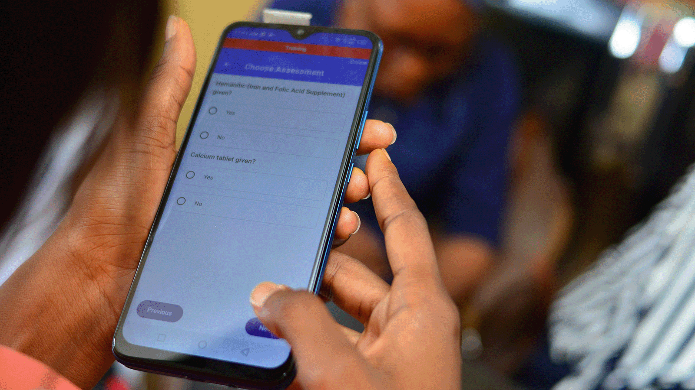

# Open Health Stack  |  Google for Developers

## Stories from the community

Explore how Open Health Stack is being used by developers around the world to build digital health solutions and improve lives.

### [Ona rebuilds the OpenSRP platform to be FHIR native](https://developers.google.com/open-health-stack/stories/ona)

[Read story](https://developers.google.com/open-health-stack/stories/ona)

### [mPower Optimizes Performance for Scaling a FHIR-based App in Bangladesh](https://developers.google.com/open-health-stack/stories/mpower)

[Read story](https://developers.google.com/open-health-stack/stories/mpower)

### [IntelliSOFT reduces development time for a maternal care app in Kenya](https://developers.google.com/open-health-stack/stories/intellisoft)

[Read story](https://developers.google.com/open-health-stack/stories/intellisoft)

### [WHO puts SMART Guidelines into action in emergency settings](https://developers.google.com/open-health-stack/stories/emcare)

[Read story](https://developers.google.com/open-health-stack/stories/emcare)

### [IPRD's Impact Health app paves the way for real-time population health insights in Nigeria](https://developers.google.com/open-health-stack/stories/iprd)

[Read story](https://developers.google.com/open-health-stack/stories/iprd)

Except as otherwise noted, the content of this page is licensed under the [Creative Commons Attribution 4.0 License](https://creativecommons.org/licenses/by/4.0/), and code samples are licensed under the [Apache 2.0 License](https://www.apache.org/licenses/LICENSE-2.0). For details, see the [Google Developers Site Policies](https://developers.google.com/site-policies). Java is a registered trademark of Oracle and/or its affiliates.

Last updated 2024-11-28 UTC.

[[["Easy to understand","easyToUnderstand","thumb-up"],["Solved my problem","solvedMyProblem","thumb-up"],["Other","otherUp","thumb-up"]],[["Missing the information I need","missingTheInformationINeed","thumb-down"],["Too complicated / too many steps","tooComplicatedTooManySteps","thumb-down"],["Out of date","outOfDate","thumb-down"],["Samples / code issue","samplesCodeIssue","thumb-down"],["Other","otherDown","thumb-down"]],["Last updated 2024-11-28 UTC."],[],[]]
